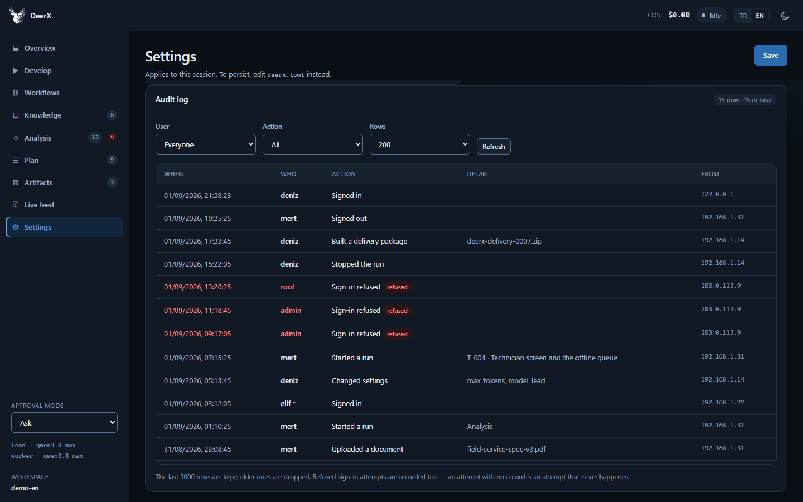

<div align="center">

<picture>
  <source media="(prefers-color-scheme: dark)" srcset="src/deerx/web/static/logo-dark.png">
  
</picture>

# DeerX

**A document-driven project development agent.**
Hand it a specification — it researches, designs, plans, builds, tests and ships.

[](LICENSE)
[](https://www.python.org/downloads/)
[](docs/verification.md)

[Documentation](docs/README.md) · [Getting started](docs/getting-started.md) · [Türkçe](README.tr.md)

</div>

<div align="center">


<sub>The run has stopped at a question only you can answer. Answering resumes it
where it left off.</sub>

</div>

---

DeerX takes a specification and runs it through thirteen phases: it indexes the
document, extracts requirements, verifies claims on the web, finds the gaps,
produces mockups and an architecture, draws up a plan, splits that plan across
specialist agents, implements it, **runs and tests what it built**, reviews it,
and packages it for delivery.

It has three faces: a **web interface**, a **CLI** and an **MCP server**.

```
1. Upload the specification + write the analyst its instruction
2. The analyst reads, extracts requirements, spots what is missing
3. If something only YOU can know is missing → the pipeline STOPS and asks you
4. You answer (or move on with an assumption) → the run continues
5. Research → gaps → mockup → architecture → plan → code → QA → review
6. If everything is green → a delivery zip → staging → live
```

## What makes it different

**It stops and asks instead of guessing.** Agents record two kinds of missing
thing. A gap the team can resolve is handled by a later phase. Information only
*you* have — "can we get the ERP's API docs?", "which segment comes first?" —
becomes a blocking question, and the pipeline halts before spending a model run
on a premise that may be wrong. A bad assumption leaks into the architecture,
then the plan, then the code.

**It runs what it writes.** The implementing agents can start a dev server, open
it in a real Chrome, click through it, read the browser console and take a
screenshot — and if the model has vision, **it sees that screenshot**, so a
misaligned layout or an unreadable slide is inside its loop rather than outside
it. Code that compiles is not code that works — a button can sit in exactly the
right place and still throw an exception when clicked. QA treats this as an
acceptance criterion, not an optional extra.

**It can run isolated.** With `execution = "docker"` the agent's commands and
services run in a disposable container instead of on your machine, so it can
install packages, delete files and kill processes without touching the host.

**It works fully local and free.** The default provider is any OpenAI-compatible
endpoint — vLLM, Ollama, LM Studio, llama.cpp. Embeddings run locally through
ONNX. Token cost zero, and your documents never leave the machine. Anthropic is
supported too, if you want it.

**It tells the model what the harness knows.** A response cut off at the token
ceiling used to be indistinguishable from a finished one, so the agent believed
it had written a file that did not exist. Now truncation is detected and
reported, turn budgets are announced before they run out, half-executed commands
are prevented, and a phase that produces no deliverable is caught rather than
passing quietly.

**It is bilingual all the way down.** One setting switches the interface, the
CLI, the event stream, tool errors, *and* the instructions and tool descriptions
the model itself reads — because an English prompt with Turkish tool docs is a
two-language context, and that costs quality.

## What it looks like

| | |
|---|---|
|  |  |
| **Develop** — hand it the spec, pick the phases, write the analyst its brief. | **Analysis** — what the agents extracted, and the questions you can answer. |
|  |  |
| **Workflows** — every run, step by step, with status, duration and cost. | **Artifacts** — mockups render live; screenshots are shown, not downloaded. |
|  |  |
| **Live feed** — every tool call and model step, kept in `.deerx/events.jsonl`. | **Settings** — including isolation: run the agent's commands in a container. |



**Audit log** — the server writes files and runs shell commands, so on a shared
install the question "who did that?" has to have an answer. Every sign-in, run,
settings change and delivery is recorded with a name, a time and an address —
refused attempts included. Admins only, and a deleted account keeps its trail:
removing a user must not be the way to clear the history.

Turkish screenshots are in [README.tr.md](README.tr.md); the interface switches
with one control.

## Quick start

You need **Python 3.11+**, **[uv](https://docs.astral.sh/uv/)**, and a model —
a local OpenAI-compatible server (vLLM, Ollama, LM Studio) or an Anthropic key.
Docker is optional but strongly recommended: it is how DeerX gets working web
search.

**1. Get it**

```bash
git clone https://github.com/BSARPEL/DeerX-App-Development-Platform.git
```

```bash
cd DeerX-App-Development-Platform && uv sync --extra all
```

**2. Let `setup` do the rest**

```bash
uv run deerx setup ~/projects/my-project
```

One command: creates the workspace, installs missing extras, starts a private
**SearXNG** search container and points the workspace at it, finds your Chrome,
probes your model endpoint, and prints a table saying which of those worked.

**3. Point it at your model** — in `~/projects/my-project/deerx.toml`:

```toml
[deerx]
openai_base_url = "http://127.0.0.1:8008/v1"
model_lead = "qwen3.8 max"     # EXACTLY the name your server serves
model_worker = "qwen3.8 max"
```

Keys go in `.env`, never in `deerx.toml`. For Anthropic instead, set
`provider = "anthropic"` and put `ANTHROPIC_API_KEY` in `.env`.

**4. Check before committing to a long run**

```bash
cd ~/projects/my-project && uv run deerx doctor
```

A model-name mismatch is the most common setup mistake, and `doctor` catches it
in two seconds instead of forty minutes into a run.

**5. Drop your specification into `docs/` and go**

```bash
uv run deerx run --goal "B2B field service management"
```

Or use the web interface — better for watching a run:

```bash
uv run deerx serve
```

On Windows you can double-click `scripts\start.cmd` instead. To expose it on
your network you first need an account (`scripts\deerx.cmd passwd`); a server
with no users refuses to bind a public address.

**Complete walkthrough, assuming no prior knowledge:
[Getting started](docs/getting-started.md).**

## The pipeline

| # | Phase | Agent | Produces |
|---|---|---|---|
| 1 | `ingest` | — | Spec + code → hybrid knowledge base |
| 2 | `analyze` | Analyst | Requirements, uncertainties, questions for you |
| 3 | `research` | Researcher | Version and standard verification, with sources |
| 4 | `assess` | Assessor | Gaps between spec, code and research |
| 5 | `mockup` | Mockup | Working single-file HTML screens, with real photographs |
| 6 | `design` | Architect | Architectural decisions (ADR), data model |
| 7 | `plan` | Planner | A task graph split into lanes |
| 8 | `implement` | Backend / Frontend / QA | Code, routed by lane |
| 9 | `qa` | QA | Tests written and run, the app used (UAT), screenshots |
| 10 | `review` | Reviewer | Requirement tracing, code audit |
| 11 | `package` | — | Readiness gate + delivery archive |
| 12 | `staging` | Staging | Clean-environment install + smoke test |
| 13 | `live` | Live | Exit gate, deployment, rollback plan |

The default range is `ingest → plan` — analysis through to a plan, **no code**.
Add `--to review` to have it built, `--to live` to go all the way.

Details: **[The pipeline](docs/pipeline.md)**.

## Documentation

| | |
|---|---|
| [Getting started](docs/getting-started.md) | Install, configure, first run |
| [The pipeline](docs/pipeline.md) | Phases, agents, lanes, the question gate |
| [Model providers](docs/providers.md) | vLLM, Ollama, OpenAI, Anthropic |
| [Web interface](docs/web-ui.md) | Every screen and why it is arranged that way |
| [CLI reference](docs/cli.md) | Commands, flags, exit codes, management scripts |
| [Configuration](docs/configuration.md) | `deerx.toml`, environment, precedence |
| [Agent tools](docs/tools.md) | All 39 tools, and how an agent tests its own work |
| [Architecture](docs/architecture.md) | Module map and the reasoning behind it |
| [Security model](docs/security.md) | Confinement, shell policy, auth, secrets |
| [Delivery packages](docs/delivery.md) | The readiness gate and secret exclusion |
| [MCP server](docs/mcp.md) | Exposing the pipeline to another agent |
| [Its own knowledge base](docs/knowledge-base.md) | Index DeerX's docs and source, then ask a model about them |
| [Troubleshooting](docs/troubleshooting.md) | Symptoms that actually occurred, their causes and fixes |
| [Extending DeerX](docs/extending.md) | Adding a tool, a phase, a provider or a language |
| [Bilingual architecture](docs/i18n.md) | How one setting reaches everything |
| [Verification status](docs/verification.md) | What was verified by running it — and what was not |

## Before you deploy it

DeerX **writes files and runs shell commands.** That is the product, and it is
also the threat model. By default they run **on the host**, fenced by a shell
allow-list — what is confined is the directory the file tools can see, not the
processes they start. `execution = "docker"` moves them into a disposable
container instead; the workspace is still mounted, so that protects the machine
but not the project.

The defaults are careful: approvals on, loopback only, and a server with no
users refuses to bind a public address. Read **[SECURITY.md](SECURITY.md)**
before changing any of that, and
**[Troubleshooting](docs/troubleshooting.md)** when one of them surprises you.

## Status

Pre-1.0, and honest about it. The suite passes and `ruff` is clean;
[Verification status](docs/verification.md) separates what was verified by
actually running it from what was not — including a live Claude API call, which
was not.

## Contributing

See **[CONTRIBUTING.md](CONTRIBUTING.md)**. Two things worth knowing first:
comments and identifiers are Turkish and ASCII-folded, and every user-facing or
model-facing string goes through the message catalog — a test enforces the
second one.

## License

MIT — see [LICENSE](LICENSE).
