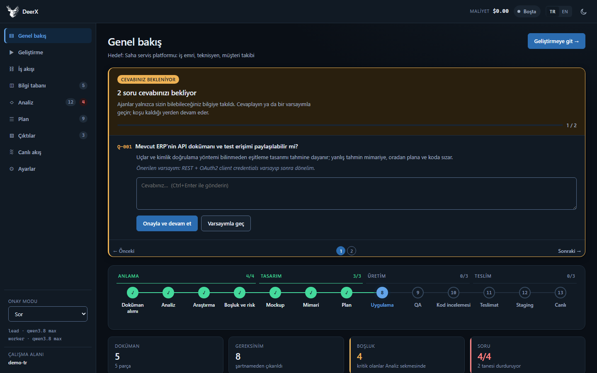
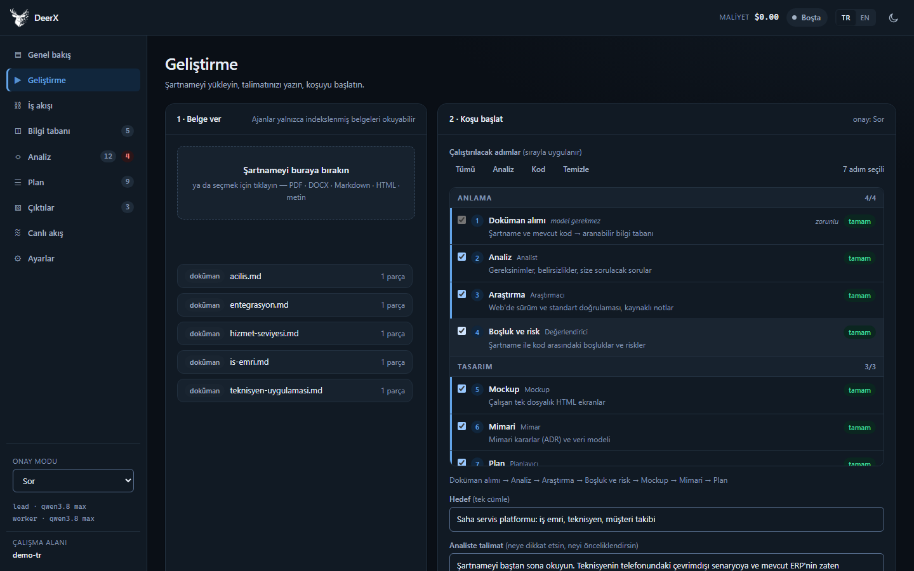
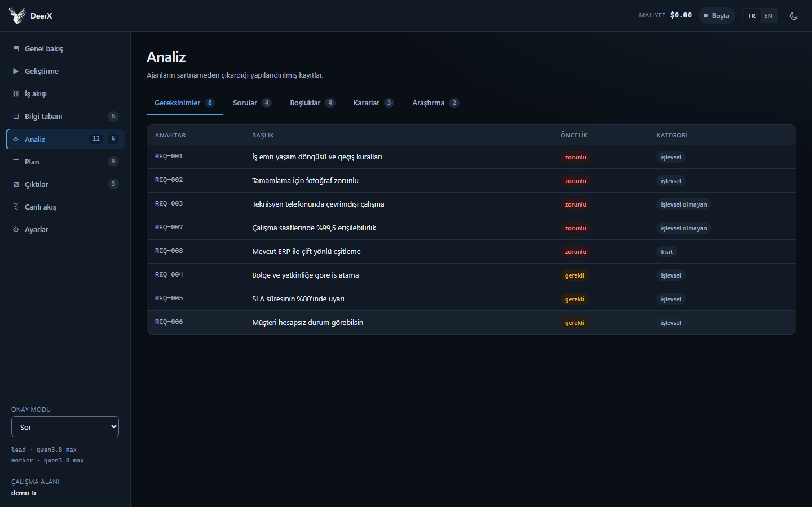
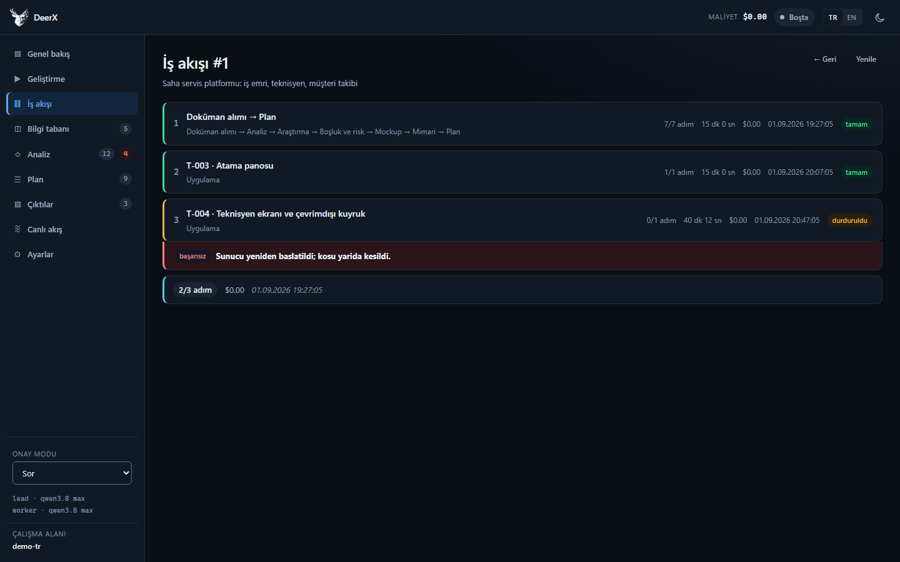
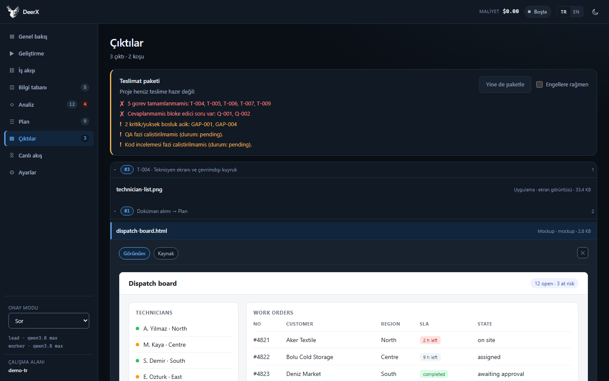
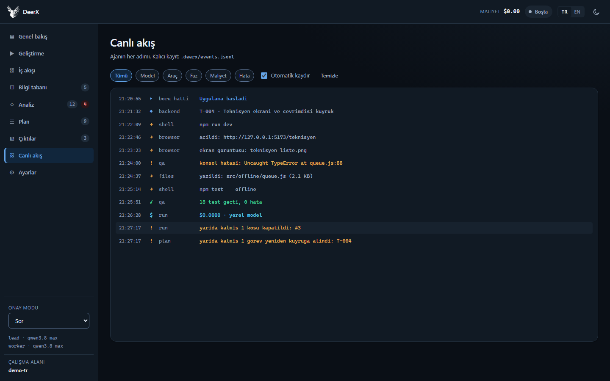
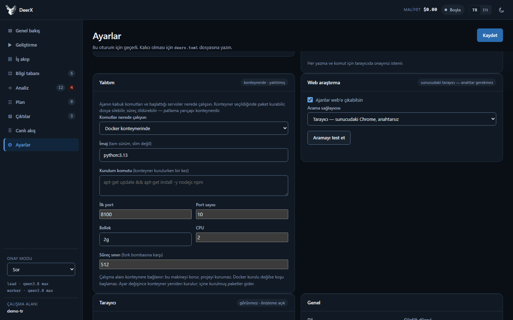
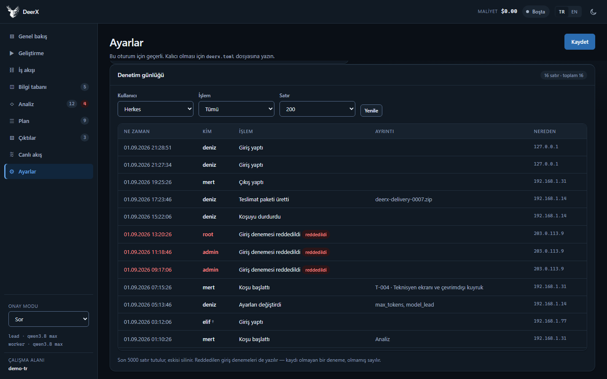

<div align="center">

<picture>
  <source media="(prefers-color-scheme: dark)" srcset="src/deerx/web/static/logo-dark.png">
  
</picture>

# DeerX

**Doküman-güdümlü proje geliştirme ajanı.**
Bir şartname verirsiniz — araştırır, tasarlar, planlar, yazar, test eder, teslim eder.

[](LICENSE)
[](https://www.python.org/downloads/)
[](docs/tr/verification.md)

[Dokümantasyon](docs/tr/README.md) · [Başlangıç](docs/tr/getting-started.md) · [English](README.md)

</div>

<div align="center">



<sub>Koşu, yalnızca sizin bilebileceğiniz bir soruda durdu. Cevaplayınca
kaldığı yerden devam eder.</sub>

</div>

---

DeerX bir şartnameyi alır ve on üç fazdan geçirir: dokümanı indeksler,
gereksinimleri çıkarır, iddiaları web'de doğrular, boşlukları bulur, mockup ve
mimari üretir, plan çıkarır, planı uzman ajanlara böler, uygular, **yazdığını
çalıştırıp test eder**, inceler ve teslimata paketler.

Üç yüzü var: **web arayüzü**, **CLI** ve **MCP sunucusu**.

```
1. Şartnameyi yükle + analiste talimatını yaz
2. Analist okur, gereksinimleri çıkarır, eksikleri tespit eder
3. Ancak SİZİN bilebileceğiniz bir şey eksikse → boru hattı DURUR, size sorar
4. Cevaplarsınız (ya da varsayımla geçersiniz) → koşu devam eder
5. Araştırma → boşluk → mockup → mimari → plan → kod → QA → inceleme
6. Her şey yeşilse → teslimat zip'i → staging → canlı
```

## Farkı ne

**Tahmin etmek yerine durup sorar.** Ajanlar iki tür eksik kaydeder. Ekibin
çözebileceği bir boşluğu sonraki faz ele alır. Yalnızca *sizin* bildiğiniz bir
bilgi — "ERP'nin API dokümanını alabilir miyiz?", "hangi segment öncelikli?" —
bloke eden bir soru olur ve boru hattı, yanlış olabilecek bir öncüle model
harcamadan durur. Hatalı bir varsayım mimariye, oradan plana, oradan koda sızar.

**Yazdığını çalıştırır.** Uygulayan ajanlar bir dev sunucusu başlatabilir,
gerçek bir Chrome'da açabilir, tıklayarak gezebilir, tarayıcı konsolunu okuyabilir
ve ekran görüntüsü alabilir — ve model görüyorsa **o görüntüyü görür**, yani
bozuk bir yerleşim ya da okunmayan bir slayt döngüsünün dışında değil içinde
kalır. Derlenen kod çalışan kod değildir — bir düğme yerli yerinde durup
tıklanınca istisna atabilir. QA bunu isteğe bağlı bir ekstra değil, kabul ölçütü
sayar.

**Yalıtılmış çalışabilir.** `execution = "docker"` ile ajanın komutları ve
servisleri sizin makinenizde değil, tek kullanımlık bir konteynerde koşar; paket
kurar, dosya siler, süreç öldürür — konağa dokunmadan.

**Tamamen yerel ve ücretsiz çalışır.** Varsayılan sağlayıcı OpenAI-uyumlu her
uçtur: vLLM, Ollama, LM Studio, llama.cpp. Gömme yerel ONNX ile yapılır. Token
maliyeti sıfır, dokümanlarınız makineden çıkmaz. İsterseniz Anthropic de
desteklenir.

**Modele, harness'ın bildiğini söyler.** Token tavanında kesilmiş bir yanıt
bitmiş bir yanıttan ayırt edilemiyordu; ajan var olmayan bir dosyayı yazdığını
sanıyordu. Artık kesilme tespit edilip bildiriliyor, tur bütçesi dolmadan önce
haber veriliyor, yarım koşan komutlar engelleniyor ve çıktısını üretmeyen bir
faz sessizce geçmek yerine yakalanıyor.

**Baştan aşağı iki dilli.** Tek bir ayar arayüzü, CLI'yi, olay akışını, araç
hatalarını *ve* modelin kendi okuduğu yönergelerle araç açıklamalarını
değiştirir — çünkü İngilizce bir yönergeyle Türkçe araç açıklaması iki dilli bir
bağlamdır ve bunun bedeli kalitedir.

## Nasıl görünüyor

| | |
|---|---|
|  |  |
| **Geliştirme** — şartnameyi verin, adımları seçin, analiste talimatını yazın. | **Analiz** — ajanların çıkardıkları ve cevaplayabileceğiniz sorular. |
|  |  |
| **İş akışı** — her koşu adım adım; durumu, süresi ve maliyetiyle. | **Çıktılar** — mockup'lar canlı çalışır, ekran görüntüleri gösterilir. |
|  |  |
| **Canlı akış** — her araç çağrısı, `.deerx/events.jsonl` dosyasında saklanır. | **Ayarlar** — yalıtım dahil: ajanın komutları konteynerde koşsun. |



**Denetim günlüğü** — sunucu dosya yazıyor ve kabuk komutu çalıştırıyor; ortak
bir kurulumda "bunu kim yaptı" sorusunun bir cevabı olmalı. Her giriş, koşu,
ayar değişikliği ve teslimat bir ad, bir saat ve bir adresle yazılır —
reddedilen denemeler dahil. Yalnızca yönetici görür, ve silinen bir hesabın izi
kalır: hesabı silmek geçmişi temizlemenin yolu olmamalı.

İngilizce ekran görüntüleri [README.md](README.md) dosyasında; arayüz tek bir
düğmeyle dil değiştirir.

## Hızlı başlangıç

Gerekenler: **Python 3.11+**, **[uv](https://docs.astral.sh/uv/)** ve bir model
— yerel bir OpenAI uyumlu sunucu (vLLM, Ollama, LM Studio) ya da bir Anthropic
anahtarı. Docker isteğe bağlı ama şiddetle önerilir: DeerX'in çalışan bir web
aramasına kavuşma yolu odur.

**1. Kodu alın**

```bash
git clone https://github.com/BSARPEL/DeerX-App-Development-Platform.git
```

```bash
cd DeerX-App-Development-Platform && uv sync --extra all
```

**2. Gerisini `setup` yapsın**

```bash
uv run deerx setup ~/projeler/projem
```

Tek komut: çalışma alanını kurar, eksik ekleri yükler, özel bir **SearXNG**
arama konteyneri başlatıp çalışma alanını ona bağlar, Chrome'unuzu bulur, model
ucunuzu yoklar, ve hangilerinin işe yaradığını söyleyen bir tablo basar.

**3. Modelinizi tanıtın** — `~/projeler/projem/deerx.toml` içinde:

```toml
[deerx]
openai_base_url = "http://127.0.0.1:8008/v1"
model_lead = "qwen3.8 max"     # sunucunuzun sunduğu adla BİREBİR
model_worker = "qwen3.8 max"
```

Anahtarlar `.env` içine, asla `deerx.toml`'a. Anthropic için
`provider = "anthropic"` yapıp `.env` içine `ANTHROPIC_API_KEY` koyun.

**4. Uzun bir koşuya girmeden doğrulayın**

```bash
cd ~/projeler/projem && uv run deerx doctor
```

En sık yapılan kurulum hatası model adı uyuşmazlığı; `doctor` onu koşunun
kırkıncı dakikasında değil iki saniyede yakalar.

**5. Şartnamenizi `docs/` altına koyup başlatın**

```bash
uv run deerx run --goal "B2B saha servis yonetimi"
```

Ya da web arayüzünü açın — bir koşuyu izlemek için daha iyi:

```bash
uv run deerx serve
```

Windows'ta `scripts\start.cmd` dosyasına çift tıklamak da olur. Ağa açmak için
önce bir hesap gerekir (`scripts\deerx.cmd passwd`); kullanıcısı olmayan bir
sunucu dışarı açılan bir adrese bağlanmayı reddeder.

**Hiçbir ön bilgi varsaymayan tam anlatım:
[Başlangıç](docs/tr/getting-started.md).**

## Boru hattı

| # | Faz | Ajan | Ne üretir |
|---|---|---|---|
| 1 | `ingest` | — | Şartname + kod → hibrit bilgi tabanı |
| 2 | `analyze` | Analist | Gereksinimler, belirsizlikler, size sorular |
| 3 | `research` | Araştırmacı | Sürüm ve standart doğrulaması, kaynaklı |
| 4 | `assess` | Değerlendirici | Şartname, kod ve araştırma arasındaki boşluklar |
| 5 | `mockup` | Mockup | Çalışan tek dosyalık HTML ekranlar, gerçek fotoğraflarla |
| 6 | `design` | Mimar | Mimari kararlar (ADR), veri modeli |
| 7 | `plan` | Planlayıcı | Şeritlere bölünmüş görev grafı |
| 8 | `implement` | Backend / Frontend / QA | Kod, şeride göre yönlendirilir |
| 9 | `qa` | QA | Test yazımı ve koşumu, uygulamanın kullanımı (UAT), ekran görüntüleri |
| 10 | `review` | İnceleyici | Gereksinim izlemesi, kod denetimi |
| 11 | `package` | — | Hazırlık kapısı + teslimat arşivi |
| 12 | `staging` | Staging | Temiz ortamda kurulum + duman testi |
| 13 | `live` | Canlı | Çıkış kapısı, dağıtım, geri alma planı |

Varsayılan aralık `ingest → plan` — analizden plana kadar, **kod yazılmaz**.
Yazdırmak için `--to review`, sonuna kadar gitmek için `--to live`.

Ayrıntı: **[Boru hattı](docs/tr/pipeline.md)**.

## Dokümantasyon

| | |
|---|---|
| [Başlangıç](docs/tr/getting-started.md) | Kurulum, yapılandırma, ilk koşu |
| [Boru hattı](docs/tr/pipeline.md) | Fazlar, ajanlar, şeritler, soru kapısı |
| [Model sağlayıcıları](docs/tr/providers.md) | vLLM, Ollama, OpenAI, Anthropic |
| [Web arayüzü](docs/tr/web-ui.md) | Her ekran ve neden öyle düzenlendiği |
| [CLI referansı](docs/tr/cli.md) | Komutlar, bayraklar, çıkış kodları, betikler |
| [Yapılandırma](docs/tr/configuration.md) | `deerx.toml`, ortam, öncelik sırası |
| [Ajan araçları](docs/tr/tools.md) | 39 aracın tamamı ve ajanın kendi işini test etmesi |
| [Mimari](docs/tr/architecture.md) | Modül haritası ve arkasındaki gerekçe |
| [Güvenlik modeli](docs/tr/security.md) | Hapsetme, kabuk politikası, kimlik, sırlar |
| [Teslimat paketleri](docs/tr/delivery.md) | Hazırlık kapısı ve sır dışlama |
| [MCP sunucusu](docs/tr/mcp.md) | Boru hattını başka bir ajana açmak |
| [Kendi bilgi tabanı](docs/tr/knowledge-base.md) | DeerX'in belgelerini ve kodunu indeksleyip bir modele sorun |
| [Sorun giderme](docs/tr/troubleshooting.md) | Gerçekten yaşanmış belirtiler, sebepleri ve çözümleri |
| [DeerX'i genişletmek](docs/tr/extending.md) | Araç, faz, sağlayıcı ya da dil eklemek |
| [İki dilli mimari](docs/tr/i18n.md) | Tek ayarın her yere ulaşması |
| [Doğrulama durumu](docs/tr/verification.md) | Koşularak doğrulananlar — ve doğrulanmayanlar |

## Kurmadan önce

DeerX **dosya yazar ve kabuk komutu çalıştırır.** Ürünün kendisi bu; tehdit
modeli de bu. Varsayılan olarak **konakta** çalışırlar ve bir kabuk izin
listesiyle çevrilidirler — hapsedilen şey dosya araçlarının gördüğü dizindir,
başlattıkları süreçler değil. `execution = "docker"` onları tek kullanımlık bir
konteynere taşır; çalışma alanı yine bağlanır, yani bu makineyi korur ama
projeyi korumaz.

Varsayılanlar dikkatli: onaylar açık, yalnızca loopback, ve kullanıcısı olmayan
bir sunucu açık bir adrese bağlanmayı reddeder. Bunlardan birini değiştirmeden
önce **[SECURITY.md](SECURITY.md)** okuyun; biri sizi şaşırttığında da
**[Sorun giderme](docs/tr/troubleshooting.md)**.

## Durum

1.0 öncesi ve bu konuda dürüst. Süit geçiyor, `ruff` temiz;
[Doğrulama durumu](docs/tr/verification.md) gerçekten koşularak doğrulananları
doğrulanmayanlardan ayırıyor — canlı bir Claude API çağrısı dahil, ki o
doğrulanmadı.

## Katkı

**[CONTRIBUTING.md](docs/tr/CONTRIBUTING.md)** dosyasına bakın. Başlamadan önce
bilinmesi gereken iki şey: yorumlar ve tanımlayıcılar Türkçe ve ASCII'ye
indirgenmiş, ve kullanıcıya ya da modele giden her metin mesaj kataloğundan
geçiyor — ikincisini bir test zorunlu kılıyor.

## Lisans

MIT — [LICENSE](LICENSE) dosyasına bakın.
