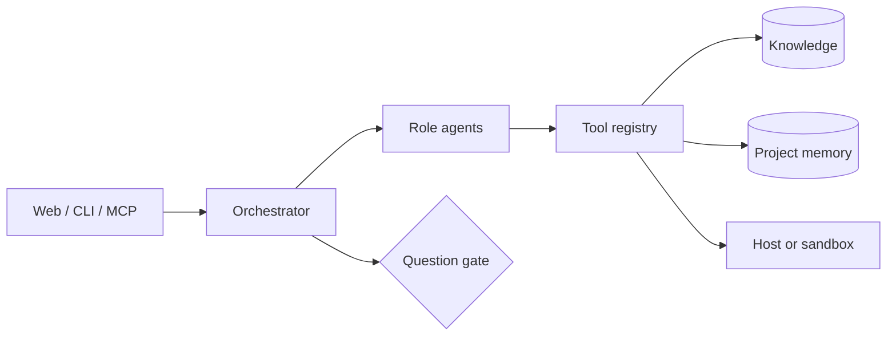

# Architecture

[← Documentation](README.md) · [Türkçe](tr/architecture.md)

## The module map

```
src/deerx/
├── config.py            deerx.toml + .env merged, role→model mapping
├── i18n.py              Turkish/English message catalog (Python side)
├── errors.py            the exception hierarchy
├── logging.py           event log, console, glyphs
├── process.py           process-tree kill, spawn flags, child environment
├── services.py          background processes bound to the run
├── sandbox.py           optional container the agent's commands run in
│
├── llm/                 provider-independent model layer
│   ├── base.py            LLMClient contract, neutral types, usage ledger
│   ├── anthropic_client.py  adaptive thinking, prompt caching, content blocks
│   ├── openai_client.py     vLLM/Ollama/OpenAI; streaming tool-call assembly
│   ├── providers.py         known services speaking each protocol, with endpoints
│   └── pricing.py           local models free, Claude priced
│
├── rag/                 knowledge base
│   ├── loaders.py         PDF / DOCX / HTML / Markdown / code
│   ├── chunker.py         chunking aware of headings and code boundaries
│   ├── embedder.py        local ONNX embeddings (fastembed) + offline fallback
│   ├── store.py           SQLite + FTS5 + numpy cosine
│   ├── retriever.py       RRF fusion + MMR diversification
│   └── knowledge.py       the single entry point
│
├── tools/               39 agent tools
│   ├── base.py            Tool contract, registry, approval gate, path confinement
│   ├── filesystem.py      read/write/edit/search, confined to the workspace
│   ├── shell.py           deny list + allow list + approval
│   ├── services.py        start_service, service_log, stop_service, list_services
│   ├── knowledge.py       search_knowledge, read_document, ingest_source
│   ├── browser.py         preview_open, browser_snapshot/_click/_type/_console
│   ├── web.py             fetch_url (persistent indexing), browse_page
│   ├── images.py          find_images / download_image, licence-aware
│   ├── project.py         record_*, save_artifact, read_project_state
│   ├── workflow.py        read_workflow, update_workflow, resolve_question
│   └── descriptions_en.py the English side of tool descriptions
│
├── agents/              13 role agents (12 pipeline + advisor)
│   ├── base.py            think → tool → observe loop, trimming, cancellation
│   ├── roles.py           role → tool set + server tools + iteration budget
│   ├── prompts.py         prompt loading with workspace and language overrides
│   └── prompts/           13 role prompts + _shared + prompts/en/
│
├── pipeline/
│   ├── models.py          13 phases, Requirement, Question, Gap, Decision, Task, Artifact
│   ├── state.py           SQLite project memory + schema migration
│   ├── packaging.py       readiness gate, secret exclusion, delivery archive
│   └── orchestrator.py    phase state machine, lane routing, question gate
│
├── browser/
│   ├── session.py         real Chrome via Playwright, lazy start
│   ├── proxy.py           filtering proxy (CONNECT + absolute-form)
│   └── policy.py          URL policy with DNS-rebinding defence
│
├── web/
│   ├── app.py             Starlette JSON API + SSE
│   ├── auth.py            users, sessions, scrypt, lockout
│   ├── runner.py          background run, event buffer, approval gate
│   └── static/            index.html + styles.css + app.js + i18n.js
│
├── mcp_server/server.py the MCP interface
└── cli.py               the Typer CLI
```



The three surfaces are one orchestrator and one database. What a *workflow*
is, and how it differs from a run, is in [Concepts](concepts.md).

## Why this design

### Structured output, not free text

Agents record findings through tools like `record_requirements` rather than
writing prose a parser has to interpret. The output is queryable, persistent and
transferable between phases — instead of trying to extract JSON from an LLM
response and handling every way that fails.

### No provider leakage

The agent loop knows no provider's message format. Only the client touches the
conversation history (`append_assistant`, `append_tool_results`, `trim_history`),
so the difference between Anthropic's content blocks and OpenAI's `tool_calls`
stays in one file.

`LLMClient` is a `Protocol`, which has a sharp edge worth knowing: bodies are
**not** inherited at runtime. A method added to the protocol and implemented in
only one client is a crash waiting for the other provider — this happened, and
tests missed it because the fake client had the method hand-added. There is now
a contract test asserting every protocol method exists in each concrete client's
own `__dict__`.

### The question gate is checked before a phase, not during

Entering a phase with an unanswered blocking question means the agent works from
a premise that may be wrong, and that work is discarded. The check costs
nothing; the phase costs a model run.

The answer is written to the project memory **and** the knowledge base. In a
long run the history gets trimmed, and an answer living only in the history
would quietly stop existing.

### Specialised agents, narrow tool sets

The Backend agent has no browser; the Live agent cannot write files. A narrow
tool set lowers token cost and removes whole classes of wrong-tool selection.
See the table in [Agent tools](tools.md) — the absences are the design.

### Hybrid search

Semantic search catches synonyms; BM25 catches proper nouns and code
identifiers. Their scores are not comparable, so they are fused by **rank**
(RRF). MMR diversification then uses the *fusion score* as the relevance term —
recomputing cosine at that point would throw the lexical contribution away
entirely.

### A serverless store

SQLite + FTS5 + numpy. At project-scale corpora a brute-force cosine search
takes milliseconds; an external vector database is a dependency without a
payoff.

The vector cache is invalidated across processes, because a document indexed
from the CLI while the web server was open used to be invisible to semantic
search.

### A fixed system prompt

Variable project state goes into the first user message, never the system
prompt. Prompt caching covers the system prefix, and variable content there
would invalidate it every turn. vLLM's prefix caching benefits from the same
shape.

### Cooperative cancellation

"Stop" raises a flag and the agent stops at a turn boundary. Cutting in the
middle of a model call would leave the conversation history inconsistent — a
tool call with no result is not a state the next turn can recover from.

### The harness tells the model what it knows

A recurring theme in this codebase: the harness knows something the model does
not, and staying silent about it produces a confident wrong answer.

| The harness knows | The model used to be told nothing | Now |
|---|---|---|
| The response hit `max_tokens` | It believed it had finished writing | Told it was cut off, and to continue rather than restart |
| Turns are nearly exhausted | It spent its last turns on research | Warned at 70%: save the deliverable first |
| A multi-line command half-ran | Exit code 0, rest silently dropped | Written to a script and run by a POSIX shell |
| The phase produced no deliverable | Reported `done` | Nudged, retried once, then failed loudly |
| Tool-call arguments were malformed JSON | Appended to history, re-read every turn | Validated and dropped before they enter the history |

### The web layer on Starlette

`starlette`, `uvicorn`, `sse-starlette` and `markdown-it-py` were already in the
dependency tree. A FastAPI layer for a few dozen routes is weight without a
return. Static files are served `no-cache` — after an upgrade, a cached `app.js`
would be incompatible with the API it talks to.

### One catalog, two languages

Interface text resolves on the client (`static/i18n.js`); everything from the
server resolves through `deerx/i18n.py`. The two share key names for phase
labels, and a test asserts they cover the same phases. See
[Bilingual architecture](i18n.md).

## Data model

The project memory in `.deerx/deerx.db`:

| Table | Holds |
|---|---|
| `requirements` | `REQ-nnn`, with a `source_ref` back into the document |
| `gaps` | `GAP-nnn`, with severity, area, evidence, recommendation |
| `decisions` | `ADR-nnn`, with alternatives and trade-offs |
| `research_notes` | Findings with source URLs and a confidence level |
| `questions` | `Q-nnn`, blocking flag, answer or assumption |
| `tasks` | `T-nnn`, lane, dependencies, files, acceptance criterion, plan |
| `plans` | Named task groups, one active |
| `artifacts` | Name, kind, path, summary, producing phase and run |
| `phases` · `runs` · `run_steps` | Phase state, run history, per-step detail |

Schema changes migrate on open. A database predating the `lane` and `plan_id`
columns opens without crashing, and tasks with no plan are carried into the main
one — the alternative is that every existing project breaks on upgrade.

## Testing

The suite makes no network calls and no real model calls: agents run
against a fake client in `tests/conftest.py`.

Three files carry unusual jobs:

- `test_regressions.py` — one test per bug that once shipped silently.
- `test_no_hardcoded_turkish.py` — an AST walk over the source; fails if a
  user- or model-facing string bypasses the catalog. It also tests **itself**,
  because a scanner whose patterns were deleted would report every file clean.
- `test_scripts.py` — the management scripts, including that every path they
  probe is in `PUBLIC_PATHS`.

## See also

- [Concepts](concepts.md) — workspace, workflows, the four stores
- [The pipeline](pipeline.md) · [Agent tools](tools.md) · [Security model](security.md)
- [Verification status](verification.md) — what was verified by running it
