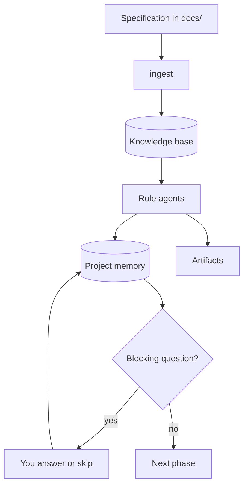
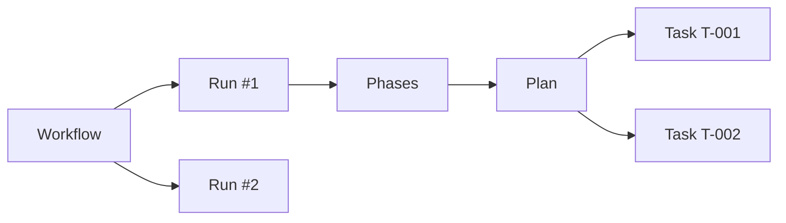

# Concepts

[← Documentation](README.md) · [Türkçe](tr/concepts.md)

This page is the map. The other documents assume you already know what a
workspace is, how a workflow differs from a run, and why the pipeline sometimes
stops and waits. If a command or a screen does not make sense yet, start here.



## Three surfaces

DeerX is one product with three faces. They share a workspace, a database and
the same settings; they do not share a process.

| Surface | Start it with | Best for |
|---|---|---|
| **Web interface** | `deerx serve` | Watching a run, answering questions, reading artifacts |
| **CLI** | `deerx run`, `deerx answer`, … | Scripting, CI, a single task from a terminal |
| **MCP server** | `deerx mcp` / `deerx-mcp` | Another agent (Claude Code, Cline) driving the same project |

A change made in the browser is visible to the CLI on the next command, and the
other way around. Two **pipeline runs** against the same workspace at once are
not: the web runner refuses a concurrent run; the MCP server cannot see a run
started elsewhere. Do not start both.

## A workspace

A workspace is one project. It is a directory DeerX owns the metadata of, not
a hidden profile somewhere else.

```
my-project/
├── deerx.toml          settings you may commit
├── .env                keys — never commit
├── docs/               the specification you give it
├── prompts/            optional role-instruction overrides
└── .deerx/             DeerX-managed; safe to delete, expensive to lose
    ├── deerx.db        requirements, gaps, decisions, tasks, questions
    ├── events.jsonl    every tool call and model step
    ├── artifacts/      reports, mockups, screenshots
    ├── teslimat/       delivery zip files
    └── browser/        the agent's own Chrome profile, not yours
```

`deerx init` creates the skeleton. `deerx setup` creates it and then installs
what is missing — SearXNG, extras, a browser probe, a model-name check.

Commands resolve the workspace by walking **upwards** for a `deerx.toml`. A
command run from a parent directory will not find a project nested below it;
set `DEERX_WORKSPACE` or pass `--workspace` if you are not inside the folder.

Workspaces are independent. Two of them on one machine have two databases, two
servers and two sets of settings. The folder name in the web sidebar exists so
you can tell them apart.

## Four stores of state

Four things persist, and they are not interchangeable.

| Store | Where | What it is for |
|---|---|---|
| **Knowledge base** | SQLite + vectors, inside `.deerx/` | What the model can *search*: the spec, the code, fetched pages, your answers |
| **Project memory** | `.deerx/deerx.db` | What the pipeline *recorded*: `REQ-001`, `GAP-003`, `Q-002`, `T-014` |
| **Event stream** | `.deerx/events.jsonl` | What happened, in order, recoverable after a restart |
| **Artifacts** | `.deerx/artifacts/` | What a phase *produced*: `analiz-raporu.md`, `mockup-*.html`, screenshots |

An answer to a blocking question is written to the project memory **and**
indexed into the knowledge base. The first closes the gate; the second is why
a later agent can still find the answer after the conversation history has
been trimmed. Putting it only in the history was how it used to vanish.

Artifact file names stay Turkish in both interface languages
(`analiz-raporu.md`, `mimari.md`, `gelistirme-plani.md`). The orchestrator
matches a phase's deliverable by file name; translating the names would break
the check that the phase actually produced something.

## Workflows, runs, plans and tasks

These four words sit on different screens and they are easy to collapse into
one. They are not one thing.



| Word | What it is | Where you see it |
|---|---|---|
| **Workflow** | A named piece of work you started — a goal, a brief, a list of steps | **Workflows** in the web UI; the number on the overview rail |
| **Run** | One execution of a step range, belonging to a workflow | The cards inside a workflow; `runs` in the database |
| **Plan** | A named group of implementation tasks | **Plan** screen; produced by the planner |
| **Task** | One unit of work with a lane, dependencies and an acceptance line | `T-nnn` in the plan; `deerx implement --task T-003` |

Starting from **Develop** creates a workflow and a run inside it. Re-running a
failed step creates a *new* run of the same workflow, beginning at that step
and following the original run's own step list — not the full pipeline, and
not "every task that happens to be ready".

A plan is independent of a run. The planner writes tasks into the **active**
plan; you can keep several (a mobile track, an alternative architecture, a
new version after the spec changed). Task keys are unique project-wide, so a
task in one plan can depend on a task in another.

## Thirteen phases, four stages

The pipeline is the product. Everything else exists so these thirteen steps
can run, stop, resume and leave something you can read.

| Stage | Phases | What you have at the end |
|---|---|---|
| **Understand** | `ingest` → `analyze` → `research` → `assess` | Requirements, verified claims, named gaps, questions for you |
| **Design** | `mockup` → `design` → `plan` | Screens you can open, ADRs, a task graph |
| **Build** | `implement` → `qa` → `review` | Code, tests that were run, a trace back to the requirements |
| **Deliver** | `package` → `staging` → `live` | A zip that passed the gate, a clean-environment smoke test, a go-live note |

The default range is Understand + Design (`ingest → plan`). **No code is
written in that range.** Read the plan first; `--to review` is what builds it.

`ingest` and `package` do not call a model. The other eleven each have a
specialist, except `implement`, which routes every task to the agent of its
lane (`backend`, `frontend`, `qa`, …). A fresh agent starts for every task, so
an interrupted run resumes at a task boundary rather than restarting the
phase.

Detail: [The pipeline](pipeline.md).

## Two kinds of missing thing

This is the distinction that decides whether a run stops.

| Kind | Tool | What happens |
|---|---|---|
| A shortcoming the team can resolve | `record_gaps` | Later phases handle it; the run continues |
| A fact only you can know | `record_questions` | If `blocking`, the pipeline stops *before* the next phase |

"Can we get the ERP's API docs?", "which segment ships first?", "what is the
budget?" — no amount of reading the specification produces those. Going on
with a guess leaks the guess into the architecture, then the plan, then the
code.

When you answer (`deerx answer`, the Overview, the Analysis tab, or the
advisor), the text is stored as a resolution **and** indexed. Skipping records
the assumption the same way. Exit code `2` means "a human is needed", not
"this broke".

## The advisor

The advisor is a thirteenth role. It is not a pipeline phase. You talk to it
about **one workflow**, and it may change that workflow's records.

| You can say | It is allowed to |
|---|---|
| "What did the analyst conclude?" | Read the workflow, the project memory, the knowledge base |
| "The answer to Q-004 is: SLA is eight hours." | Close that question and index the answer |
| "Call this workflow the mobile track." | Rename it |
| "Add a requirement that exports must be CSV." | Record a requirement |

It has no shell, no file-write tools and no browser. A sentence from you
cannot become a command on the machine. The three tools that exist only
inside this conversation (`read_workflow`, `update_workflow`,
`resolve_question`) take no workflow id — the caller pins the scope, so a
wrong number from the model cannot edit the wrong workflow.

Open it from a workflow's detail view, or:

```bash
uv run deerx chat 2 "What is still blocking the plan?"
uv run deerx chat 2 --history
```

The same conversation is on MCP as `deerx_workflow_chat`.

## Isolation

By default the agent's `run_command` and `start_service` run **on this
machine**, fenced by a shell allow-list. The file tools can only see the
workspace; the processes they start are not confined.

`execution = "docker"` moves those commands into a disposable container. The
workspace is still mounted, so this protects the host, not the project. The
allow-list is then not applied: there is no host left to protect, and the
container is deleted when the run ends.

The web **Settings → Isolation** panel writes the same keys for the session
and rebuilds the container. Persist them in `deerx.toml`.

## Language

One setting, `language = "tr"` or `"en"`, reaches the interface, the CLI, the
event stream, the tool errors, **and** the instructions and tool descriptions
the model itself reads. Switching only the browser would leave the stream and
the agents in the other language.

The switch in the top bar persists to the server. `DEERX_LANGUAGE` overrides
the file for one invocation — it has to, because CLI help is built at import
time, before `deerx.toml` is read.

Artifact file names, as above, do not follow the setting.

## Where to look next

| If you want to… | Read |
|---|---|
| Install it and run it once | [Getting started](getting-started.md) |
| Know what each phase produces | [The pipeline](pipeline.md) |
| Point it at vLLM, Ollama or Anthropic | [Model providers](providers.md) |
| Understand a screen | [Web interface](web-ui.md) |
| Script it | [CLI reference](cli.md) |
| Change a setting | [Configuration](configuration.md) |
| Know what an agent is allowed to do | [Agent tools](tools.md) |
| Expose it on the network, or lock it down | [Security model](security.md) |
| Drive it from another agent | [MCP server](mcp.md) |
| Fix something that already happened here | [Troubleshooting](troubleshooting.md) |
