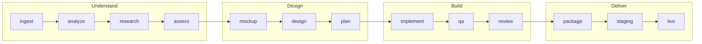

# The pipeline

[← Documentation](README.md) · [Türkçe](tr/pipeline.md)

DeerX runs a specification through thirteen phases. Each one writes its findings
into the project memory as structured records, and the next phase inherits them.
The words around the pipeline — workspace, workflow, run, plan — are in
[Concepts](concepts.md).



```
ingest → analyze → research → assess → mockup → design → plan
       → implement → qa → review → package → staging → live
       └── understand ──┘ └─ design ─┘ └─── build ───┘ └─ deliver ─┘
```

## The phases

| # | Phase | Agent | What it produces |
|---|---|---|---|
| 1 | `ingest` | — | Spec + existing code → hybrid knowledge base (RAG) |
| 2 | `analyze` | **Analyst** | Requirements, uncertainties → `analiz-raporu.md` |
| 3 | `research` | **Researcher** | Version/standard verification on the web → `arastirma-notlari.md` |
| 4 | `assess` | **Assessor** | Spec ↔ code ↔ research difference → `bosluk-analizi.md` |
| 5 | `mockup` | **Mockup** | Working single-file HTML screens, with real photographs → `mockup-*.html` |
| 6 | `design` | **Architect** | Architectural decisions (ADR), data model → `mimari.md` |
| 7 | `plan` | **Planner** | Task graph split into lanes → `gelistirme-plani.md` |
| 8 | `implement` | **Backend / Frontend / QA** | Code — each task routed by its lane |
| 9 | `qa` | **QA** | Writes and runs tests, opens and uses the app (UAT) → `qa-raporu.md` |
| 10 | `review` | **Reviewer** | Requirement tracing, code audit → `dogrulama-raporu.md` |
| 11 | `package` | — | Readiness gate + delivery archive |
| 12 | `staging` | **Staging** | Install in a clean environment + smoke test → `staging-raporu.md` |
| 13 | `live` | **Live** | Exit gate, deployment, rollback plan → `canli-cikis-raporu.md` |

Phases 1 and 11 need no model — they are deterministic.

Artifact names stay Turkish in both interface languages. `PHASE_DELIVERABLE` in
the orchestrator matches a phase's output by file name, so translating them
would break the check described under [Deliverables are enforced](#deliverables-are-enforced).

## Two kinds of missing thing

This is the distinction that decides whether a run stops:

| What | Tool | Result |
|---|---|---|
| A shortcoming or risk the team can resolve itself | `record_gaps` | Later phases handle it, the run continues |
| Information only you can know | `record_questions` | You are asked; if `blocking`, the run stops |

Going on with a wrong assumption is almost always more expensive than stopping
to ask — a bad assumption leaks into the architecture, then the plan, then the
code, and every layer built on it has to be redone.

Agents are instructed to prefer `record_gaps`. A question is for things like
"can we get the ERP's API documentation?", "which customer segment comes first?",
"what is the budget limit?" — facts that no amount of research or reading will
produce.

## The question gate

The gate is checked **before** entering a phase, not during it.

```
phase N finishes → gate: any open blocking questions? → phase N+1
                            │
                            └─ yes → stop, report, exit code 2
```

Checking before rather than during matters: entering a new phase with an
unanswered question means the agent works on a premise that may be wrong, and
that work is thrown away. The check costs nothing; the wasted phase costs a
model run.

When you answer, the answer goes to two places:

- the **project memory**, so the question is closed and later phases see the
  resolution;
- the **knowledge base**, so `search_knowledge` finds it. In a long run the
  conversation history gets trimmed, and an answer that lived only in the
  history would silently stop existing.

If you skip instead, the assumption you give (or one the agent forms) is
recorded and carried forward the same way.

## Lane routing

The planner assigns every task a `lane`, and the orchestrator hands the task to
that lane's specialist:

| lane | agent | scope |
|---|---|---|
| `backend` | Backend | data schema, migration, business logic, API, integration, authentication |
| `frontend` | Frontend | components, pages, routing, client state, styling, accessibility |
| `qa` | QA | writing tests, verification, edge-case sweeps |
| `infra` | Backend | configuration, build, containers, CI |
| `docs` | Backend | README, API documentation, run instructions |

Agents are told to *split* work across lanes rather than write one task that
does everything: the API endpoint a backend task, the form a frontend task, the
test a qa task. Narrow tasks mean narrow tool sets, cleaner context and a
dependency graph that actually orders the work.

**A fresh agent starts for every task.** The context stays clean, the cost stays
predictable, and an interrupted run resumes at the task boundary rather than
restarting the phase.

## Deliverables are enforced

A phase that reports `done` without producing its artifact used to be
indistinguishable from one that did the work — and every later phase would then
be built on something that did not exist.

Now the orchestrator knows what each phase owes:

```
phase ends → is the deliverable on disk?
               │
               ├─ yes → done
               └─ no  → nudge the agent, run it once more
                          │
                          ├─ produced → done
                          └─ still nothing → FAIL, with the pattern named
```

The nudge tells the model exactly what is expected and that reading and
researching is only half the job. If the second attempt still produces nothing,
the phase fails loudly instead of passing quietly.

## Workflows and runs

A **workflow** is the named piece of work you started: a goal, a brief, the
steps you picked. A **run** is one execution of a step range inside that
workflow. Starting from Develop creates both. Re-running a failed step
creates a new run of the *same* workflow, beginning at that step and
following the original run's own list — not the full pipeline.

The advisor talks about a workflow, not about a run. See
[Concepts](concepts.md#workflows-runs-plans-and-tasks).

## Plans

Tasks live in **plans**. A plan is a named, independent group of tasks:

- parallel workstreams (`mobile`, `backend`),
- alternative approaches to the same problem,
- a new version opened when the specification changes.

One plan is **active** at a time — that is where the planner writes new tasks.
Task keys are unique project-wide, so a task in one plan can depend on a task in
another and no reference is ambiguous.

## Resuming

Runs are resumable in three ways:

- **Phase level.** A completed phase is skipped unless you pass `--force`. The
  orchestrator also re-runs a phase whose stored result belongs to a *different
  goal* — a previous answer to a different question is not an answer to this one.
- **Task level.** Tasks left `running` when a process dies return to the queue at
  the next startup. If they did not, neither they nor anything depending on them
  would ever be ready, and the plan would deadlock.
- **Question level.** A run stopped at the gate continues with
  `deerx run --from <phase>` after you answer.

## Costs and budgets

Every phase records its token usage and cost. Local models are priced at zero;
Claude is priced from a table in `llm/pricing.py`.

`cost_limit_usd` in `deerx.toml` caps the whole run — when it is exceeded the
run stops with `BudgetExceeded` rather than continuing to spend.

Agents also get told when they are running out of **turns**. At 70% of the
iteration budget the agent receives a note: wrap up, save the deliverable first,
do the remaining research after. Before that existed, an agent could spend its
last turns on research and be stopped with nothing saved — an unsaved review
counts as never having happened.

## See also

- [Agent tools](tools.md) — what each agent can actually do
- [Delivery packages](delivery.md) — the readiness gate at phase 11
- [Architecture](architecture.md) — how the orchestrator and state are built
