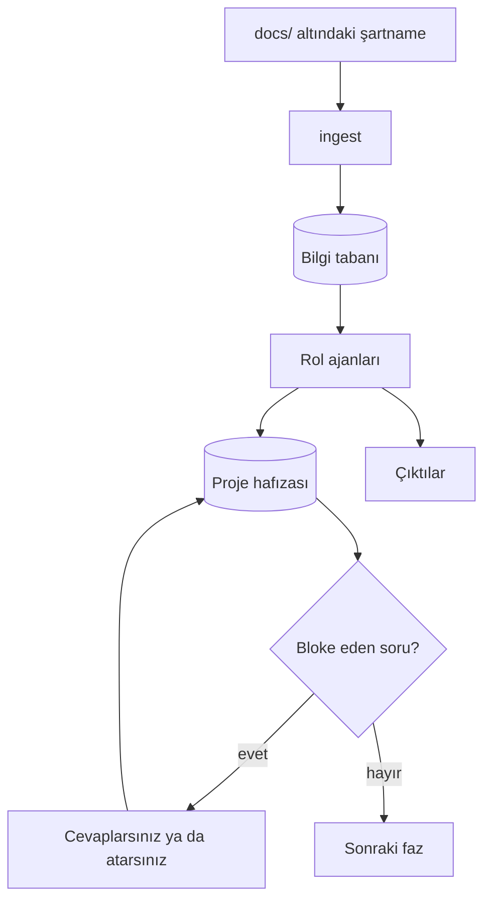
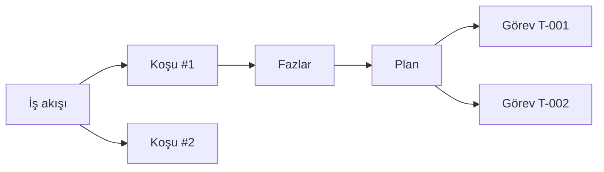

# Kavramlar

[← Dokümantasyon](README.md) · [English](../concepts.md)

Bu sayfa haritadır. Diğer belgeler bir çalışma alanının ne olduğunu, bir iş
akışının bir koşudan nasıl ayrıldığını ve boru hattının neden durup
beklediğini bildiğinizi varsayar. Bir komut ya da ekran henüz anlam
ifade etmiyorsa buradan başlayın.



## Üç yüz

DeerX tek üründür, üç yüzü vardır. Çalışma alanını, veritabanını ve ayarları
paylaşırlar; süreci paylaşmazlar.

| Yüz | Başlatmak | En iyisi |
|---|---|---|
| **Web arayüzü** | `deerx serve` | Koşuyu izlemek, soruları cevaplamak, çıktıları okumak |
| **CLI** | `deerx run`, `deerx answer`, … | Betik, CI, uçbirimden tek bir görev |
| **MCP sunucusu** | `deerx mcp` / `deerx-mcp` | Aynı projeyi süren başka bir ajan (Claude Code, Cline) |

Tarayıcıda yapılan bir değişiklik bir sonraki komutta CLI'de görünür; tersi
de öyle. Aynı çalışma alanına karşı aynı anda iki boru hattı **koşusu**
değildir: web koşucusu eşzamanlı koşuyu reddeder; MCP sunucusu başka yerde
başlatılmış bir koşuyu göremez. İkisini birden açmayın.

## Çalışma alanı

Çalışma alanı bir projedir. DeerX'in üstverisini sahip olduğu bir dizindir;
başka bir yerde gizlenmiş bir profil değildir.

```
projem/
├── deerx.toml          işleyebileceğiniz ayarlar
├── .env                anahtarlar — asla işlemeyin
├── docs/               verdiğiniz şartname
├── prompts/            isteğe bağlı rol yönergesi ezmeleri
└── .deerx/             DeerX yönetir; silmek güvenli, kaybetmek pahalı
    ├── deerx.db        gereksinimler, boşluklar, kararlar, görevler, sorular
    ├── events.jsonl    her araç çağrısı ve model adımı
    ├── artifacts/      raporlar, mockup'lar, ekran görüntüleri
    ├── teslimat/       teslimat zip dosyaları
    └── browser/        ajanın kendi Chrome profili, sizinki değil
```

`deerx init` iskeleti kurar. `deerx setup` onu kurar ve eksikleri kapatır —
SearXNG, ekler, tarayıcı yoklaması, model adı kontrolü.

Komutlar `deerx.toml` ararken **yukarı** yürüyerek çalışma alanını çözer. Bir
üst dizinden çalıştırılan komut, altındaki bir projeyi bulmaz; klasörün
içinde değilseniz `DEERX_WORKSPACE` verin ya da `--workspace` geçin.

Çalışma alanları bağımsızdır. Aynı makinede ikisinin iki veritabanı, iki
sunucusu ve iki ayar kümesi vardır. Web kenar çubuğundaki klasör adı, onları
ayırt edebilmeniz için vardır.

## Dört durum deposu

Dört şey kalıcıdır ve birbirinin yerine geçmez.

| Depo | Nerede | Ne için |
|---|---|---|
| **Bilgi tabanı** | `.deerx/` içinde SQLite + vektörler | Modelin *arayabileceği* şey: şartname, kod, çekilmiş sayfalar, cevaplarınız |
| **Proje hafızası** | `.deerx/deerx.db` | Boru hattının *kaydettiği* şey: `REQ-001`, `GAP-003`, `Q-002`, `T-014` |
| **Olay akışı** | `.deerx/events.jsonl` | Ne oldu, sırasıyla; yeniden başlatmadan sonra da durur |
| **Çıktılar** | `.deerx/artifacts/` | Bir fazın *ürettiği* şey: `analiz-raporu.md`, `mockup-*.html`, ekran görüntüleri |

Bloke eden bir sorunun cevabı proje hafızasına **ve** bilgi tabanına yazılır.
İlki kapıyı kapatır; ikincisi, konuşma geçmişi kırpıldıktan sonra sonraki
ajanın cevabı hâlâ bulabilmesinin sebebidir. Yalnızca geçmişte durması,
eskiden kaybolmasının yoluydu.

Çıktı dosya adları iki arayüz dilinde de Türkçe kalır (`analiz-raporu.md`,
`mimari.md`, `gelistirme-plani.md`). Orkestratör bir fazın teslimatını dosya
adına bakarak eşler; adları çevirmek, fazın gerçekten bir şey üretip
üretmediğini denetleyen kontrolü kırardı.

## İş akışları, koşular, planlar ve görevler

Bu dört sözcük farklı ekranlarda durur ve tek şeye indirgenmesi kolaydır.
Tek şey değillerdir.



| Sözcük | Nedir | Nerede görünür |
|---|---|---|
| **İş akışı** | Başlattığınız adlandırılmış iş — bir hedef, bir talimat, bir adım listesi | Web'de **İş akışı**; genel bakış rayındaki numara |
| **Koşu** | Bir adım aralığının bir kez çalışması, bir iş akışına ait | Bir iş akışının içindeki kartlar; veritabanında `runs` |
| **Plan** | Adlandırılmış bir uygulama görevleri grubu | **Plan** ekranı; planlayıcı üretir |
| **Görev** | Şeridi, bağımlılıkları ve bir kabul satırı olan bir iş birimi | Plandaki `T-nnn`; `deerx implement --task T-003` |

**Geliştirme** ekranından başlamak bir iş akışı ve içinde bir koşu açar.
Kırılan bir adımı yeniden koşturmak *aynı* iş akışının yeni bir koşusunu
açar; o adımdan başlar ve özgün koşunun kendi adım listesini izler — tüm
boru hattını değil, "hazır olan her görevi" de değil.

Plan, koşudan bağımsızdır. Planlayıcı görevleri **etkin** plana yazar;
birkaçını birden tutabilirsiniz (bir mobil hat, alternatif bir mimari,
şartname değiştikten sonra yeni bir sürüm). Görev anahtarları proje çapında
tekildir, yani bir planın görevi başka bir planın görevine bağlı olabilir.

## On üç faz, dört evre

Boru hattı üründür. Geri kalan her şey bu on üç adımın koşabilmesi, durması,
devam etmesi ve okunacak bir şey bırakması için vardır.

| Evre | Fazlar | Sonda elinizde olan |
|---|---|---|
| **Anla** | `ingest` → `analyze` → `research` → `assess` | Gereksinimler, doğrulanmış iddialar, adlandırılmış boşluklar, size sorular |
| **Tasarla** | `mockup` → `design` → `plan` | Açabileceğiniz ekranlar, ADR'ler, bir görev çizgesi |
| **Yap** | `implement` → `qa` → `review` | Kod, koşturulmuş testler, gereksinimlere iz |
| **Teslim et** | `package` → `staging` → `live` | Kapıdan geçmiş bir zip, temiz ortamda duman testi, canlıya çıkış notu |

Varsayılan aralık Anla + Tasarla'dır (`ingest → plan`). **O aralıkta kod
yazılmaz.** Önce planı okuyun; yazdıran `--to review`'dır.

`ingest` ve `package` model çağırmaz. Diğer on birinin her birinin bir
uzmanı vardır; `implement` hariç — o her görevi şeridinin ajanına verir
(`backend`, `frontend`, `qa`, …). Her görev için taze bir ajan başlar, yani
yarıda kesilen bir koşu fazı baştan değil görev sınırından devam eder.

Ayrıntı: [Boru hattı](pipeline.md).

## İki tür eksik

Koşunun durup durmayacağına bu ayrım karar verir.

| Tür | Araç | Ne olur |
|---|---|---|
| Ekibin çözebileceği bir eksik | `record_gaps` | Sonraki fazlar ele alır; koşu devam eder |
| Yalnızca sizin bilebileceğiniz bir olgu | `record_questions` | `blocking` ise boru hattı *sonraki fazdan önce* durur |

"ERP'nin API dokümanını alabilir miyiz?", "hangi segment önce çıkar?",
"bütçe nedir?" — şartnameyi ne kadar okusanız bunları üretmez. Tahminle
devam etmek tahmini mimariye, oradan plana, oradan koda sızdırır.

Cevapladığınızda (`deerx answer`, Genel bakış, Analiz sekmesi ya da
danışman) metin bir çözüm olarak saklanır **ve** indekslenir. Atlamak
varsayımı aynı yolla kaydeder. Çıkış kodu `2` "insana ihtiyaç var"
demektir, "bu bozuldu" değil.

## Danışman

Danışman on üçüncü roldür. Bir boru hattı fazı değildir. Onunla **tek bir
iş akışı** hakkında konuşursunuz; o iş akışının kayıtlarını değiştirebilir.

| Söyleyebileceğiniz | Yapmasına izin verilen |
|---|---|
| "Analist ne sonuç çıkardı?" | İş akışını, proje hafızasını, bilgi tabanını okumak |
| "Q-004'ün cevabı: SLA sekiz saat." | O soruyu kapatmak ve cevabı indekslemek |
| "Bu iş akışına mobil hat de." | Yeniden adlandırmak |
| "Dışa aktarım CSV olmalı diye bir gereksinim ekle." | Bir gereksinim kaydetmek |

Kabuğu yoktur, dosya yazma aracı yoktur, tarayıcısı yoktur. Sizin bir
cümleniz makinede bir komuta dönüşemez. Yalnızca bu konuşmanın içinde var
olan üç araç (`read_workflow`, `update_workflow`, `resolve_question`) iş
akışı kimliği almaz — kapsamı çağıran sabitler, modelin yanlış bir sayı
üretmesi yanlış akışı düzenleyemez.

Bir iş akışının ayrıntı görünümünden açın, ya da:

```bash
uv run deerx chat 2 "Plani hala ne bloke ediyor?"
uv run deerx chat 2 --history
```

Aynı konuşma MCP'de `deerx_workflow_chat` olarak durur.

## Yalıtım

Varsayılan olarak ajanın `run_command` ve `start_service` çağrıları **bu
makinede** koşar ve bir kabuk izin listesiyle çevrilidir. Dosya araçları
yalnızca çalışma alanını görür; başlattıkları süreçler hapsedilmez.

`execution = "docker"` bu komutları tek kullanımlık bir konteynere taşır.
Çalışma alanı yine bağlanır, yani bu konağı korur, projeyi değil. İzin
listesi o zaman uygulanmaz: korunacak konak kalmamıştır ve konteyner koşu
bitince silinir.

Web'deki **Ayarlar → Yalıtım** paneli aynı anahtarları oturum için yazar
ve konteyneri yeniden kurar. Kalıcı olmaları için `deerx.toml`'a yazın.

## Dil

Tek ayar, `language = "tr"` ya da `"en"`, arayüze, CLI'ye, olay akışına,
araç hatalarına **ve** modelin kendi okuduğu yönergelerle araç
açıklamalarına ulaşır. Yalnızca tarayıcıyı değiştirmek akışı ve ajanları
diğer dilde bırakırdı.

Üst çubuktaki anahtar sunucuya yazılır. `DEERX_LANGUAGE` tek bir çağrı
için dosyayı ezer — ezmek zorundadır, çünkü CLI yardımı `deerx.toml`
okunmadan, içe aktarım anında kurulur.

Çıktı dosya adları, yukarıda yazıldığı gibi, bu ayarı izlemez.

## Sonra nereye

| İstediğiniz… | Okuyun |
|---|---|
| Kurup bir kez koşturmak | [Başlangıç](getting-started.md) |
| Her fazın ne ürettiğini bilmek | [Boru hattı](pipeline.md) |
| vLLM, Ollama ya da Anthropic'e bağlamak | [Model sağlayıcıları](providers.md) |
| Bir ekranı anlamak | [Web arayüzü](web-ui.md) |
| Betik yazmak | [CLI referansı](cli.md) |
| Bir ayarı değiştirmek | [Yapılandırma](configuration.md) |
| Bir ajanın ne yapabileceğini bilmek | [Ajan araçları](tools.md) |
| Ağa açmak ya da kilitlemek | [Güvenlik modeli](security.md) |
| Başka bir ajandan sürmek | [MCP sunucusu](mcp.md) |
| Burada daha önce yaşanmış bir şeyi onarmak | [Sorun giderme](troubleshooting.md) |
