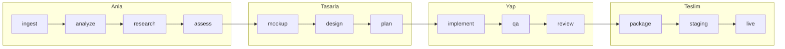

# Boru hattı

[← Dokümantasyon](README.md) · [English](../pipeline.md)

DeerX bir şartnameyi on üç fazdan geçirir. Her faz bulgularını proje hafızasına
yapılandırılmış kayıt olarak yazar, sonraki faz onları devralır. Boru
hattının etrafındaki sözcükler — çalışma alanı, iş akışı, koşu, plan —
[Kavramlar](concepts.md) sayfasında.



```
ingest → analyze → research → assess → mockup → design → plan
       → implement → qa → review → package → staging → live
       └──── anlama ────┘ └ tasarım ┘ └─── üretim ───┘ └ teslim ┘
```

## Fazlar

| # | Faz | Ajan | Ne üretir |
|---|---|---|---|
| 1 | `ingest` | — | Şartname + kod → hibrit bilgi tabanı (RAG) |
| 2 | `analyze` | **Analist** | Gereksinimler, belirsizlikler → `analiz-raporu.md` |
| 3 | `research` | **Araştırmacı** | Web'de sürüm/standart doğrulaması → `arastirma-notlari.md` |
| 4 | `assess` | **Değerlendirici** | Şartname ↔ kod ↔ araştırma farkı → `bosluk-analizi.md` |
| 5 | `mockup` | **Mockup** | Çalışan tek dosyalık HTML ekranlar, gerçek fotoğraflarla → `mockup-*.html` |
| 6 | `design` | **Mimar** | Mimari kararlar (ADR), veri modeli → `mimari.md` |
| 7 | `plan` | **Planlayıcı** | Şeritlere bölünmüş görev grafı → `gelistirme-plani.md` |
| 8 | `implement` | **Backend / Frontend / QA** | Kod — her görev şeridine göre yönlendirilir |
| 9 | `qa` | **QA** | Test yazar ve koşar, uygulamayı açıp kullanır (UAT) → `qa-raporu.md` |
| 10 | `review` | **İnceleyici** | Gereksinim izlemesi, kod denetimi → `dogrulama-raporu.md` |
| 11 | `package` | — | Hazırlık kapısı + teslimat arşivi |
| 12 | `staging` | **Staging** | Temiz ortamda kurulum + duman testi → `staging-raporu.md` |
| 13 | `live` | **Canlı** | Çıkış kapısı, dağıtım, geri alma planı → `canli-cikis-raporu.md` |

1. ve 11. fazlar model gerektirmez — deterministiktir.

Çıktı adları iki arayüz dilinde de Türkçe kalır. Orkestratördeki
`PHASE_DELIVERABLE` bir fazın çıktısını dosya adına bakarak eşler, dolayısıyla
çevirmek [Çıktılar zorunlu tutulur](#çıktılar-zorunlu-tutulur) bölümündeki
kontrolü kırardı.

## İki tür eksik

Bir koşunun durup durmayacağına karar veren ayrım budur:

| Ne | Araç | Sonuç |
|---|---|---|
| Ekibin kendi çözebileceği eksiklik veya risk | `record_gaps` | Sonraki fazlar ele alır, koşu devam eder |
| Yalnızca sizin bilebileceğiniz bilgi | `record_questions` | Size sorulur; `blocking` ise koşu durur |

Yanlış bir varsayımla ilerlemek durup sormaktan neredeyse her zaman daha
pahalıya patlar — hatalı varsayım mimariye, oradan plana, oradan koda sızar ve
üstüne kurulan her katman yeniden yapılmak zorunda kalır.

Ajanlara `record_gaps`'i tercih etmeleri söylenir. Soru, "ERP'nin API dokümanını
alabilir miyiz?", "hangi müşteri segmenti öncelikli?", "bütçe sınırı nedir?"
gibi şeyler içindir — hiçbir araştırmanın ya da okumanın üretemeyeceği bilgiler.

## Soru kapısı

Kapı bir faza **girmeden önce** yoklanır, faz sırasında değil.

```
faz N biter → kapı: açık bloke eden soru var mı? → faz N+1
                       │
                       └─ evet → dur, bildir, çıkış kodu 2
```

Sırasında değil öncesinde yoklamak önemlidir: cevapsız bir soruyla yeni bir faza
girmek, ajanın yanlış olabilecek bir öncül üzerinde çalışması demektir ve o iş
çöpe gider. Kontrolün maliyeti yok; boşa giden fazın maliyeti bir model koşusu.

Cevapladığınızda cevap iki yere gider:

- **Proje hafızasına**, böylece soru kapanır ve sonraki fazlar çözümü görür;
- **Bilgi tabanına**, böylece `search_knowledge` onu bulur. Uzun bir koşuda
  konuşma geçmişi kırpılır ve yalnızca geçmişte yaşayan bir cevap sessizce var
  olmaktan çıkardı.

Bunun yerine atlarsanız, verdiğiniz (ya da ajanın kurduğu) varsayım aynı şekilde
kaydedilip ileri taşınır.

## Şerit yönlendirmesi

Planlayıcı her göreve bir `lane` atar ve orkestratör görevi o şeridin uzmanına
verir:

| lane | ajan | kapsam |
|---|---|---|
| `backend` | Backend | veri şeması, göç, iş mantığı, API, entegrasyon, kimlik doğrulama |
| `frontend` | Frontend | bileşen, sayfa, yönlendirme, istemci durumu, stil, erişilebilirlik |
| `qa` | QA | test yazımı, doğrulama, kenar durum taraması |
| `infra` | Backend | yapılandırma, derleme, konteyner, CI |
| `docs` | Backend | README, API dokümanı, çalıştırma talimatı |

Ajanlara işi tek bir görevde toplamak yerine şeritlere *bölmeleri* söylenir: API
ucu backend görevi, form frontend görevi, test qa görevi. Dar görevler dar araç
kümesi, temiz bağlam ve işi gerçekten sıralayan bir bağımlılık grafı demektir.

**Her görev için taze bir ajan başlar.** Bağlam temiz kalır, maliyet
öngörülebilir olur ve kesilen bir koşu fazı baştan almak yerine görev sınırından
devam eder.

## Çıktılar zorunlu tutulur

Çıktısını üretmeden `done` diyen bir faz, işi yapmış bir fazdan ayırt
edilemiyordu — ve sonraki her faz var olmayan bir şeyin üstüne kuruluyordu.

Artık orkestratör her fazın ne borçlu olduğunu biliyor:

```
faz biter → çıktı diskte mi?
              │
              ├─ evet → tamam
              └─ hayır → ajanı yönlendir, bir kez daha koştur
                           │
                           ├─ üretti → tamam
                           └─ hâlâ yok → BAŞARISIZ, desen adıyla
```

Yönlendirme modele tam olarak ne beklendiğini ve okumakla araştırmanın işin
yalnızca yarısı olduğunu söyler. İkinci deneme de bir şey üretmezse faz sessizce
geçmek yerine yüksek sesle başarısız olur.

## İş akışları ve koşular

**İş akışı**, başlattığınız adlandırılmış iştir: bir hedef, bir talimat,
seçtiğiniz adımlar. **Koşu**, o iş akışının içinde bir adım aralığının bir
kez çalışmasıdır. Geliştirme'den başlatmak ikisini birden açar. Kırılan bir
adımı yeniden koşturmak *aynı* iş akışının yeni bir koşusunu açar; o
adımdan başlar ve özgün koşunun kendi listesini izler — tüm boru hattını
değil.

Danışman bir koşu hakkında değil, bir iş akışı hakkında konuşur. Bkz.
[Kavramlar](concepts.md#iş-akışları-koşular-planlar-ve-görevler).

## Planlar

Görevler **planlarda** yaşar. Plan, adlandırılmış bağımsız bir görev grubudur:

- paralel iş akışları (`mobil`, `backend`),
- aynı probleme alternatif yaklaşımlar,
- şartname değiştiğinde açılan yeni bir sürüm.

Aynı anda tek bir plan **etkindir** — planlayıcının yeni görevleri oraya düşer.
Görev anahtarları proje çapında tekildir, yani bir planın görevi başka bir
planın görevine bağımlı olabilir ve hiçbir referans belirsiz kalmaz.

## Devam ettirme

Koşular üç şekilde devam ettirilebilir:

- **Faz düzeyi.** Tamamlanmış bir faz, `--force` vermedikçe atlanır. Orkestratör
  ayrıca saklanan sonucu *farklı bir hedefe* ait olan bir fazı yeniden koşturur
  — başka bir soruya verilmiş cevap bu sorunun cevabı değildir.
- **Görev düzeyi.** Süreç öldüğünde `running` kalan görevler bir sonraki açılışta
  kuyruğa döner. Dönmeselerdi ne kendileri ne de onlara bağlı olanlar hazır
  sayılırdı; plan tümden kilitlenirdi.
- **Soru düzeyi.** Kapıda duran bir koşu, cevapladıktan sonra
  `deerx run --from <faz>` ile devam eder.

## Maliyet ve bütçe

Her faz token kullanımını ve maliyetini kaydeder. Yerel modeller sıfır
fiyatlanır; Claude `llm/pricing.py` içindeki tablodan.

`deerx.toml` içindeki `cost_limit_usd` tüm koşuyu sınırlar — aşıldığında koşu
harcamaya devam etmek yerine `BudgetExceeded` ile durur.

Ajanlara **tur** bütçelerinin tükendiği de söylenir. İterasyon bütçesinin
%70'inde ajan bir not alır: toparla, önce çıktıyı kaydet, kalan araştırmayı
sonra yap. Bu yokken bir ajan son turlarını araştırmaya harcayıp hiçbir şey
kaydetmeden durdurulabiliyordu — kaydedilmemiş bir inceleme hiç yapılmamış
sayılır.

## Ayrıca

- [Ajan araçları](tools.md) — her ajan gerçekte ne yapabiliyor
- [Teslimat paketleri](delivery.md) — 11. fazdaki hazırlık kapısı
- [Mimari](architecture.md) — orkestratör ve durum nasıl kurulu
