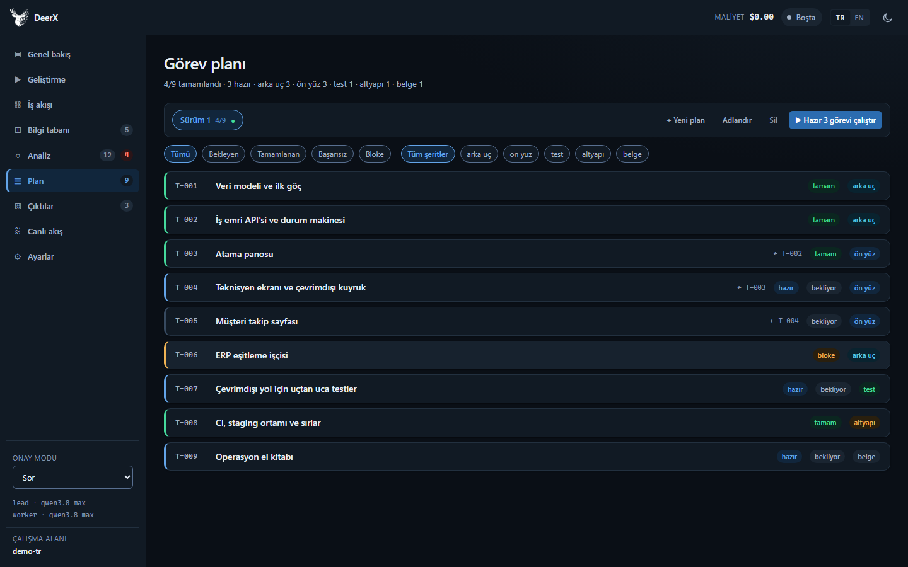

# Web arayüzü

[← Dokümantasyon](README.md) · [English](../web-ui.md)

```bash
uv run deerx serve
```

`http://localhost:8791` açılır. Derleme adımı yok — arayüz düz `index.html` +
`styles.css` + `app.js`, ve `no-cache` ile servis edilir ki bayat bir `app.js`
bir API değişikliğinden sonra hayatta kalamasın.

> Sunucu dosya yazabilir ve kabuk komutu çalıştırabilir. Varsayılan olarak
> `127.0.0.1` dinler. Bunu değiştirmeden önce
> [Güvenlik modeli](security.md) okuyun.

## Üst bar

Maliyet, koşu durumu, **TR / EN** dil anahtarı ve tema düğmesi.

Dil anahtarı tek tıklamada her şeyi değiştirir — ve **sunucuda kalıcı olur**,
çünkü okuduğunuzun yalnızca yarısı tarayıcıdan gelir. Olay akışı, araç hataları
ve ajan yönergeleri Python tarafından gelir; sadece istemciyi değiştiren bir
anahtar arayüzü İngilizce, akışı Türkçe bırakırdı. Sunucu değişikliği
reddederse arayüz de geri döner — sunucunun paylaşmadığı bir dilde kalmaz.

Aynı ayar Ayarlar ekranında da duruyor ve iki yol tek bir fonksiyondan geçiyor;
yoksa biri sunucuya yazar diğeri yazmaz ve fark görünmez olurdu.

Dar ekranda maliyet üst bardan düşer; Genel bakış'ta zaten kart olarak var.

## Sol ray

Bölümler, ve en altta hangi ekranda olursanız olun değişmeyen üç şey: onay modu,
kullanılan iki model, ve **hangi çalışma alanındasınız** — klasörün adı.

Sonuncusu şunun için: aynı makinede açık iki DeerX penceresi birbirinin aynı
görünüyor. Yol Ayarlar ekranında bir satırdı, yani doğrulamak için **Başlat**'a
basmak üzere olduğunuz ekrandan çıkmak gerekiyordu.

Yazan tek şey klasörün adı. İki çalışma alanını ayırt eden şey zaten o; tam yol
iki satır yer kaplıyor ve arayüzün her ekran görüntüsüne bir ev dizini
sokuyordu. Yol düğmenin ipucunda duruyor, tıklayınca panoya kopyalanıyor — pano
kullanılamıyorsa bir bildirimle geri geliyor, yani düğme hiçbir zaman sessizce
ölü kalmaz.

Dar ekranda rayın dibi, rayın dikey düzeniyle birlikte kalkar; çalışma alanı
Ayarlar ekranında durmaya devam eder.

## Genel bakış


Özet panosu. **Cevap bekleyen sorular** en üstte durur — her şeyin üstünde,
çünkü şu anda sizi gerektiren tek şey durmuş bir boru hattıdır.

Altında: 13 fazlık boru hattı şeridi (hangi ajan, hangi durum, ne kadar
maliyet), sayım kartları, her ajanın kendi kapanış notuyla fazların özeti (en
yeni üstte) ve son olaylar.

## Geliştirme


İşin başladığı yer. Yan yana iki adım.

**1 · Belge ver.** Şartnameyi sürükleyin. Dosya `docs/` altına iner, hemen
indekslenir ve modelin gerçekten okuyabileceği belgeler hemen altında
listelenir — böylece "şartnamemi aldı mı?" sorusu aynı ekranda cevaplanır.

**2 · Koşu başlat.** Adımları bir listeden seçersiniz; dört aşamaya
gruplanmışlardır (**Anlama · Tasarım · Üretim · Teslim**). Aşama başlığına
tıklamak o grubun tümünü seçer ya da bırakır.

Her satır adımın adını değil, **ne üreteceğini** söyler — "plan" yerine
"Şeritlere bölünmüş, bağımlılıklı görev listesi". Boru hattını zaten
bilmiyorsanız faz adlarından oluşan bir liste bilgi değildir.

Satırlar ayrıca hangi ajanın koşacağını, adım zaten bitmişse rozetini ve
maliyetini gösterir. `Tümü` / `Analiz` / `Kod` ön ayarları hazır gelir ve
koşunun izleyeceği yol listenin altında tek satırda özetlenir.

Bu ekrandan başlatmak bir **iş akışı** ve içinde bir **koşu** açar. Fark —
ve bir tekrarın neden aynı iş akışının yeni koşusu olduğu —
[Kavramlar](concepts.md#iş-akışları-koşular-planlar-ve-görevler) sayfasında.

Bilinmesi gereken iki davranış:

- Seçim, ne sırayla tıkladığınıza bakılmaksızın **boru hattı sırasına** dizilir.
- **1. adım (doküman alımı) her zaman dahildir.** Bilgi tabanı boşken sonraki
  hiçbir ajanın okuyacak bir şeyi olmaz.

## Koşular


Her koşu kendi kimliğiyle kalıcıdır ve sıralı bir numara alır (`#1`, `#2`, …).

Liste hedefi, adımları, kaçının bittiğini, süreyi, maliyeti, tarihi ve durumu
gösterir. Bir koşuyu açmak adım adım dökümü verir — her adım kendi kartında:
hangi ajan koştu, kaç araç çağrısı ve kaç model yanıtı, kaç hata ve uyarı, ne
kadar sürdü, ne kadara mal oldu, ne üretti. Kartı açmak ajanın kapanış özetini,
hata metnini, çıktıları (tıklanabilir) ve **o adıma ait ham olay akışını**
gösterir.

Çalışan ve sorun çıkaran adımlar kendiliğinden açık gelir.

**Adımlar koşunun kendi kaydından gelir**, faz durumundan değil. Faz durumu
projeye aittir ve her tekrar koşuda üzerine yazılır — geçmiş bir koşuya
bakarken onu okumak size dünkü başlığın altında bugünkü sonucu gösterirdi.
Olaylar üretildikleri koşuya ve faza etiketlenir; döküm
`.deerx/events.jsonl` üzerinden bir sunucu yeniden başlatmasını atlatır.

### Hatadan sonra devam etmek

Kırılan adımda **Buradan itibaren tekrar çalıştır** düğmesi vardır; iş akışı
görünümünde de hatanın yanında **Kırılan adımdan devam et** durur. İkisi de o
adımdan başlayıp *o koşunun* kalan adımlarıyla devam eden yeni bir koşu açar.

Üç şey bunu yaklaşık değil sadık kılıyor:

* **En erken hata seçilir**, en son değil. Sonraki hatalar çoğu zaman ilkinin
  sonucudur; arkadakinden başlamak aynı duvara tekrar çarpar.
* **Adım listesi özgün koşudan gelir**, boru hattının sırasından değil.
  `ingest → analyze → plan` koştuysanız tekrar sessizce `research` ve `assess`
  eklemez — onları bilerek dışarıda bırakmıştınız.
* **Koşu neyi koşturduğunu hatırlar.** Tek bir görev için açılan koşu o görevin
  anahtarını taşır; tekrar o görevi koşar, hazır olan bütün görevleri değil.

Adımlar atlanmaz, zorlanır: bu adımı açıkça siz istediniz ve "zaten
tamamlandı" demek düğmeyi işlevsiz bırakırdı. Sonraki adımlar da zorlanır,
çünkü kırılan bir adımın üstüne kurulmuş çıktı şüphelidir.

Cevap bekleyen bir adıma (`needs_input`) tekrar sunulmaz. Ajan işini yapmış,
sizi bekliyor; tekrar koşmak aynı soruyu ikinci kez sormaktır. Onun yeri
**Genel bakış**.

Tekrar, denetim günlüğüne `run.retry` olarak yazılır.

## Bir iş akışı hakkında konuşmak

Bir iş akışının ayrıntı görünümünde **Bu iş akışı hakkında konuş** vardır.
*O* iş akışına kilitli bir çekmece açar — yüzen düğme aynı şeyi söyler.

Sorarsınız, ya da neyin değişmesini istediğinizi söylersiniz. Danışman bir
soruyu kapatabilir, iş akışını yeniden adlandırabilir, hedefi ya da talimatı
düzenleyebilir, bir bulgu kaydedebilir. Komut çalıştıramaz, proje dosyası
yazamaz. Yaptığı değişiklikler yanıtın altında listelenir; sessiz bir
düzenleme gizlenemez.

Konuşma iş akışıyla saklanır. **Geçmişi sil** onu temizler. Aynı konuşma
CLI'de `deerx chat`, MCP'de `deerx_workflow_chat`'tir; üç değil, bir geçmiş
vardır.

Neye dokunabildiği, ve iş akışı kimliğinin modele neden argüman olarak
verilmediği: [Kavramlar — Danışman](concepts.md#danışman).

## Canlı akış


Ajanın attığı her adım SSE ile gelir: araç çağrıları, model metni, maliyet,
hatalar. Türe göre filtrelenir ve sayfalanır — son sayfa "canlı"dır ve yeni
olaylar oraya akar.

Geçmiş bir sayfaya gitmek akışın altınızdan kaymasına yol açmaz. Sayaç artmaya
devam eder ve bir **● Canlıya dön** düğmesi belirir.

**Boş değil, geçmişle açılır.** `.deerx/events.jsonl` dosyasının sonu açılışta
geri okunur; yeniden başlatılan bir sunucu ajanın ne yaptığını silmez — genel
bakıştaki *Son olaylar* da dolar. Akış "saklanıyor" diyor ama sayfa
yenilendiğinde hiçbir şey göstermiyordu; ekranda bitmeyen denetlenebilirlik
denetlenebilirlik değildir.

## Plan



**Çoklu plan.** Bir plan, adlandırılmış bağımsız bir görev grubudur: paralel iş
akışları, alternatif yaklaşımlar ya da şartname değiştikten sonra açılan yeni
bir sürüm. Üstteki şerit onları seçer, oluşturur, adlandırır ve siler. **●**
*etkin* planı işaretler — planlayıcının yeni görevleri oraya düşer.

Görev listesi seçili plana göre süzülür. Her görev tek tek ilerletilebilir
(**Bu görevi uygula**) ya da bütün plan **▶ Başlat** ile koşturulabilir — düğme
kaç görevin hazır olduğunu, hazır yoksa nedenini söyler.

Görev anahtarları proje çapında tekildir, yani bir planın görevi başka bir
planın görevine bağımlı olabilir ve belirsizlik kalmaz.

## Analiz


Gereksinimler, boşluklar, mimari kararlar ve araştırma bulguları. Bir satıra
tıklamak dayanağını ve önerisini açar. Sayfalanır (25/50/100/250); sekme
değiştirmek ilk sayfaya döner ve açık ayrıntı satırları sayfalar arasında
karışmaz.

**Açık sorular buradan cevaplanır.** Sorular sekmesi salt okunur bir kayıt
değil: açık bir soruyu genişletmek cevap kutusunu verir ve cevap her cevap gibi
bilgi tabanına yazılır. Eskiden yalnızca boru hattını *durduran* sorular, o da
yalnızca durduğu anda cevaplanabiliyordu — hattın yanından geçtiği bir soru bir
daha cevaplanamıyordu. İlk iddiası "tahmin etmek yerine sorar" olan bir ürüne
yakışmıyordu.

## Bilgi tabanı

Modelin gerçekten arayabileceği şey. İki panel.

**Arama.** Bir sorgu ve tür yongaları — doküman, kod, web, veri. `deerx
search` ile aynı hibrit arama: anlamsal artı BM25, sıra bazlı füzyon.
Sonuçlar kaynağı ve parçayı adlandırır; "şartnamemi indeksledi mi?" sorusu
kırk dakika sonra değil burada cevaplanır.

**İndeksleme.** Bir yol, isteğe bağlı **Zorla**, ve indeksteki belgeler,
sayfalanmış. **Geliştirme** ekranından yüklemek dosyayı `docs/` altına
indirir ve indeksler; bu ekran gerisi içindir — ekstra bir klasör, gömme
modelini değiştirdikten sonra yeniden indeks, çekilmiş bir sayfanın durup
durmadığı.

Değişmemiş dosyalar, zorlamadıkça atlanır. `embedding_model`'i `--force`
(ya da bu kutu) olmadan değiştirmek eski vektörleri yeni bir boyutun
yanında bırakır ve DeerX sessizce yanlış isabet döndürmek yerine aramayı
reddeder.

## Çıktılar


**Koşuya göre gruplanmış, açılır-kapanır.** Her satır bir koşu: **hangi iş
akışına ait olduğu**, kendi numarası, hedefi, kaç ek dosya (🗜) ve kaç çıktı.
Açmak o koşunun ürettiği her şeyi listeler, her biri hangi fazda üretildiğini
söyleyerek. En yeni koşu açık, geri kalanı kapalı gelir — yirmi koşuda hepsi
açıksa aradığınızı bulamazsınız.

Koşu bir *iş akışının adımıdır*, yani "bu mockup hangi akıştan çıkmıştı"
sorusunun bu ekranda cevabı yoktu; İş akışları ekranına gidip aramak
gerekiyordu. `İA #n` rozeti cevaplıyor, ve tıklayınca o akışın adımlarına
götürüyor. İş akışları kaydedilmeden önceki koşularda rozet yok — uydurulmuş
bir numara, olmayan bir akışa götürürdü.

- Markdown raporlar işlenir; ham HTML enjeksiyonu kapalıdır.
- HTML mockup'lar `sandbox` iframe içinde canlı çalışır.
- **Ekran görüntüleri gösterilir, indirtilmez.** `browser_screenshot` "kullanıcı
  arayüzde görür" diyor; `.png` ikili sayıldığı sürece bu doğru değildi. Tarama
  görüntüleri (`png`, `jpg`, `gif`, `webp`, `avif`) satır içi çizilir. `.svg`
  bilerek dışarıda: SVG betik taşıyabilir ve doğrudan açılırsa uygulamanın kendi
  kaynağında çalışır.
- Zip ve diğer ikili çıktılar indirme kartıyla **ek dosya** olarak durur. Bir
  arşivin baytlarını metin sanıp dökmek bir ekran dolusu çöp üretir; onun yerine
  paketin `TESLIMAT.md` dosyası altında rapor olarak işlenir.

Teslimat paketleri kendi koşularının altında görünür, üstte tekrarlanmaz. Elle
paketleme tek adımlı bir koşu kaydı oluşturur — yoksa ürettiği paket hiçbir
koşuya ait olmaz ve Koşular görünümünden erişilemezdi.

Koşu kaydından önceki dönemden kalan çıktılar varsayılan olarak gizlidir ama
**sayılır ve erişilebilir**: başlıktaki düğme kaç tane olduğunu söyler ve
onları *Koşu kaydından önce üretilenler* başlığı altında açar. Rozet 11 derken
ekranda 1 çıktı görünüyordu ve aradaki farkı kapatacak hiçbir düğme yoktu.

Aynı görünüm **teslimat panelini** de taşır: hazırlık durumu, paketleme düğmesi,
zip indirmeleri ve paket başına bir **Rapor** düğmesi.

## Ayarlar


Tek ekran, **üç kapsam sekmesi**, üç Kaydet — çünkü "kendi ayarıma bakayım" ile
"kullanıcıları yönetelim" arasındaki fark bir sekme farkı, bir gezinme farkı
değil:

| Sekme | İçindekiler | Kim yazabilir |
|---|---|---|
| Bu proje | modeller, üretim sınırları, koşu davranışı | proje `developer` |
| Hesabım | dil, parolanız, açık oturumlarınız | siz |
| Platform | sağlayıcı ve anahtarlar, yalıtım, web araştırma, tarayıcı, günlük düzeyi, kullanıcılar, denetim günlüğü | hesap `admin` |

Bir alanın hangi sekmeye düştüğünü sunucu söylüyor (`field_scopes`); arayüze
kopyalanmış bir liste, alan tablosuna yeni bir ayar eklendiği gün ondan sessizce
ayrılır ve o ayar hiçbir sekmede görünmez. Her Kaydet yalnızca kendi sekmesinin
kilitli olmayan alanlarını gönderiyor. Tek düğme otuz sekiz alanı birden
gönderirken, yalnızca dilini değiştiren bir üyenin gövdesinde `sandbox_image` de
gidiyor, istek ilk platform alanında reddediliyor ve o kişi **hiçbir** ayarını
kaydedemiyordu.

"Hesabım" gerçekten kişiye özel: `<DEERX_HOME>/users/<kimlik>.toml` dosyasına
yazılıyor, proje dosyasına değil. Her kapsam iki kovaya düştüğü sürece arayüzü
İngilizceye çeviren kişi, o projeye giren herkesin ekranını İngilizce
yapıyordu.

**Yalıtım** paneli `execution` ayarının yeri — konak ya da Docker konteyneri —
imaj, kurulum komutu, yayınlanan port aralığı ve bellek/CPU/süreç sınırlarıyla
birlikte. Yalıtılmış çalışmak README'nin başa koyduğu üç şeyden biri olduğu
halde bu ayar yalnızca `deerx.toml` dosyası elle düzenlenerek açılabiliyordu.
*Konak* seçiliyken konteyner alanları gizlenir: hiçbir yerin okumadığı ayarı
göstermek, ayarın etkili olduğunu düşündürür.

Üç düğme gerçek çağrı yapar:

- **Bağlantıyı test et** modele "OK" yazdırır; süreyi, token sayısını ve cevabı
  bildirir.
- **Aramayı test et** gerçekten arar.
- **Tarayıcıyı test et** gerçekten bir tarayıcı açar.

Bu düğmelerle, kırk dakikalık bir koşunun ortasında "model adı yanlışmış"
demek arasındaki fark, onların var olma sebebidir.

Her panelin başlığında ayarlardan türeyen bir durum satırı vardır: anahtar
tanımlı mı, hangi arama sağlayıcısı kullanılıyor, tarayıcı görünmez mi çalışıyor
ve ajanın kendi uygulamasını açmasına izin var mı. Arama satırı, anahtar gerekli
olduğunu varsaymak yerine sağlayıcının lisans durumunu söyler: altı
sağlayıcıdan üçü (`browser`, `duckduckgo`, `searxng`) anahtar istemez ve yeni
bir kurulum, çalışan bir aramanın yanında kırmızı "arama çalışmaz" uyarısıyla
açılıyordu.

Dört kural:

- **API anahtarları geri dönmez** — yalnızca tanımlı olup olmadıkları.
- **Model ayarı koşu ortasında değişmez**; değişince LLM istemcisi düşürülür.
  İstemci o değerleri kurulumda okur, düşürülmezse değişiklik sunucu yeniden
  başlatılana kadar sessizce etkisiz kalırdı.
- **Yalıtım da koşu ortasında değişmez**; değişince konteyner yeniden kurulur.
  Docker yayınlanan portları ve kaynak sınırlarını konteyner yaratılırken
  ayırır, yeniden kurmadan hiçbiri etkili olmaz.
- **Değişiklikler oturuma özeldir.** Kalıcı olmaları için `deerx.toml`
  dosyasına yazın.

## Onay kapısı

`approval_mode = "ask"` iken her dosya yazma ve komut çalıştırma tarayıcıda
önizlemesiyle gösterilir ve koşu iş parçacığı cevap gelene kadar bloke olur.

Bu bloke etme gerçek, göstermelik değil: bir test koşu iş parçacığının
gerçekten tutulduğunu ve cevapla serbest bırakıldığını doğruluyor.

## Projeler

Bir **proje, kayıtlı bir dizindir**. Kimliği platform veritabanında bir satır,
verisi kendi dosyasında: `<proje>/.deerx/deerx.db`. Yol, projenin kendisi değil,
satırın bir özelliğidir.

Alternatif — her şeyi tek merkezi veritabanında toplayıp bütün tablolara
`project_id` eklemek — üç ölçülmüş nedenle reddedildi. `requirements.key`,
`tasks.key`, `artifacts.name`, `documents.source` ve `phase_state(phase)`
üzerindeki `UNIQUE` kısıtlarını bileşiğe çıkarmak gerekirdi; SQLite'ta bu, beş
tabloyu yeniden yaratıp veri kopyalamak demek: deponun ilk kez **veri taşıyan**,
yarıda kesilirse projeyi bozan göçü. Test fikstürleri tek `ProjectState` ve tek
`KnowledgeBase` varsayıyor ve dizin modelinde o imza hiç değişmiyor. Ajanın
ortamı da **zaten** bir dizin — kabin onu bağlıyor, servisler orada koşuyor,
dosya araçları oraya hapsolmuş — yani veriyi birleştirmek iki ayrı izolasyon
ekseni bırakırdı.

Yetki **iki katmanlıdır** ve karıştırılmamalı:

| Katman | Roller | Neyi yönetir |
|---|---|---|
| Hesap | `admin`, `user` | Platform işleri: kimlik bilgileri, yalıtım, kim hesap açabilir |
| Proje | `owner`, `developer`, `viewer` | Tek bir projedeki işler |

Platform yöneticisi her projeye erişir — yoksa sahibi ayrılmış bir proje
kimsenin açamadığı bir dizine dönüşürdü. Proje sahibi platform ayarlarına
dokunamaz. `viewer` okur, `developer` koşturur, üyeliği yalnızca `owner`
verir. Üye listesini her üye okuyabilir: bir sır değil, ve o liste olmadan
"bu koşuyu ayşe başlattı" satırındaki ayşe hiç kimse.

**Gizleme, kapat.** Yetkinizin yetmediği bir yazma düğmesi yerinde durur ama
çalışmaz; üzerinde hangi rolün gerektiği yazar. Silmek "böyle bir şey yok"
yalanı olurdu ve onu aramaya devam ederdiniz. Her denetim gereksinimini
`data-needs-role` ile taşıyor, bir test de sunucudaki `_require_role`
çağrılarını okuyup istek attığı uçtan farklı bir rol beyan eden denetimi
reddediyor. Yalnızca içeriği **bütünüyle** yetki dışı olan bölüm gizleniyor:
kilitli bir "Kullanıcı ekle" formu ekranı gürültüyle doldurur, bilgi vermez.

Üç ret artık birbirine benzemiyor. **403** çıkışı olan bir ekran oluyor, **404**
kaydın gittiğini söylüyor, **409** kimin meşgul olduğunu; yalnızca ulaşılamayan
sunucu bir rozet — yanında ekrandaki bilginin kaç saniye önceye ait olduğunu
söyleyen bir şerit. Üçü de aynı gri "Yüklenemedi" iken yetki mi istemek, listeye
mi dönmek, beklemek mi gerektiği bilinmiyordu.

Bir koşu **kimin başlattığını** hatırlıyor (`runs.started_by`; boş olması meşru —
`deerx run` ile açılan koşunun sahibi yoktur). Kendi adınız size geri
yazılmıyor, başkasınınki her zaman yazılıyor ve başkasının koşusunu durdurmak
önce soruyor. Onay modalı yalnızca koşuyu başlatana ve yalnızca `developer`a
açılıyor: tam ekran ve engelleyici, ve önceden projeye bağlı **her** tarayıcıya
geliyordu — bir izleyici, iki düğmesi de 403 dönen bir kutuya kilitleniyordu.

Proje kaydetmek dizini oluşturmaz ve içine dokunmaz: kayıt, var olan bir şeyin
üzerine konan bir etikettir. Aynı dizin ikinci kez kaydedilemez — iki satır tek
bir dizini gösterirse iki proje aynı veritabanını paylaşır ve biri ötekinin
görevlerini görür. Arşivlemek silmeden gizler; silmek, o projede yapılmış her
şeyin geçmişini de silmek olurdu.

**Projeyi adres taşır**: `#/p/<kısa-ad>/<görünüm>[/<detay>]`. Bir bağlantının
paylaşılabilir olmasını sağlayan şey bu — "şu plana bak" dendiğinde hangi
projenin açılacağına gönderen karar verir, alıcının çerezi değil. Hash sunucuya
`X-DeerX-Project` başlığıyla ulaşıyor ve başlık çerezden **önce** okunuyor;
çerez yalnızca "en son kullandığım proje" olarak, hash'siz açılan bir adres
için kalıyor. Çerez tarayıcı geneli: tek taşıyıcı oyken A sekmesinde proje
değiştiren kişi B sekmesinin sonraki isteğini de taşıyordu ve B'deki *Başlat*
başka projeyi koşturuyordu.

Güvenlikten bir şey götürmüyor: üyelik **her** istekte doğrulanıyor, başlık da
çerez de istemciden geliyor. Doğrulanmayan bir kısa ad başkasının işini açmak
yerine hiçbir projeye çözülmüyor.

Her açık projenin kendi çalışma zamanı var: ayarlar, olay günlüğü, orkestratör
ve koşu yöneticisi. `RunBusy`yi proje kapsamlı yapan şey bu — önceden bir
kişinin koşusu herkesinkini reddediyordu, ki bu çok kullanıcılı olmanın tam
tersi. Aynı anda en fazla sekiz proje açık kalır; sınıra gelindiğinde en uzun
süredir dokunulmamış **boştaki** proje kapatılır. Koşusu süren bir proje asla
kapatılmaz: kapatmak, birinin işini yarıda kesmek olurdu.

## Kullanıcılar ve kimlik doğrulama

Kimlik doğrulama **bir kullanıcı var olduğu anda** devreye girer. Kullanıcısız
yerel bir kurulum eskisi gibi çalışır — ama **kullanıcısız bir sunucu ağa
açılamaz**: `--host 0.0.0.0` başlamayı reddeder. Dosya yazıp komut çalıştıran
bir uç için uyarı basmak yeterli olmazdı.

İlk yönetici, yalnızca sunucunun konsoluna basılan bir **kurulum jetonuyla**
oluşturulur; böylece sunucuya önce ulaşan biri yönetici hesabını kapamaz.

Yöneticiler hesapları arayüzden yönetir, **kapatma** dahil. Kapatmak silmek
değildir — ayrılan biri geri dönebilir ve hesabı silmek geçmişteki izlerini de
anlamsızlaştırırdı. Kapatılan hesabın oturumları anında düşer; yoksa kapatma
işlemi kullanıcı çıkış yapana kadar hiçbir şey yapmamış olurdu.

Parola politikası ve arkasındaki kararlar için
[Güvenlik modeli](security.md).

## Denetim günlüğü

Hesap panellerinin altında, ve **yalnızca yöneticiye**: kim ne zaman girmiş, ne
çalıştırmış, neyi değiştirmiş. Her satırda bir saat, bir ad, bir işlem, bir
ayrıntı ve geldiği adres var; reddedilen giriş denemeleri de burada, kırmızıyla
ve denenen adın altında.

Üç süzgeç — kişi, işlem türü, satır sayısı. Süzgeçleri dolduran listeler
kullanıcı listesinden değil günlüğün kendisinden gelir: silinmiş bir hesabın
satırları da aranabilir, ve yalnızca *denenmiş* bir ad da seçenek olarak durur.
Listeler birbirini de daraltmaz. "Koşu"yu seçmek kişi listesini olduğu gibi
bırakır, çünkü öteki süzgeci daraltan bir süzgeç ikinci seçimi imkânsız kılar.

İşlem adları sabit tanımlayıcı olarak saklanır, ekranda çevrilir. Koşu
başlıkları da bir çeviri anahtarı taşır — Türkçe başlatılmış bir koşu İngilizce
ekranda da doğru okunsun diye; koşu listesinin zor yoldan öğrendiği ders.

Günlüğün tavanı son 5000 satır, ve proje veritabanını paylaşıyor.

## Tasarım

Palet markadan türetilmiştir: logonun laciverti (`#082850`) başlangıç noktası ve
tüm ölçek o mavi ailesinde kalır. Anlamsal renkler (ok/warn/err/info) aynı
parlaklık ve doygunluk ailesine çekildi ki yan yana geldiklerinde biri
diğerinden yüksek sesli durmasın.

Her değer, ait olduğu bileşene değil bir **role** cevap verir. Tipografi yedi
punto kullanır ve her birinin bir işi vardır: 11px büyük harf mikro-etiket ve
sayaçlar, 12px meta satırları, 13px gövde ve kontrol etiketleri, 14px nesne
başlıkları, 17px ve üstü sayfa başlıkları. Boşluk — yalnızca `gap` değil,
`padding` de — dört piksellik ızgaraya oturur; bloklar arası ayraç tek bir
`--stack`, büyük harf aralığı tek bir `--track-caps`, hareket de on bir değil
iki süredir.

Derinlik ölçülmüştür, süs değildir. Üç yüzey basamağı birbirinden en az 1.16:1
ayrışır; çünkü göz, 1.2:1'in altındaki farkı tek bir düzlem olarak okur. Açık
temada yükselti iki katmanlı gerçek bir gölgedir; koyu temada üst kenarın
aydınlanmasıdır — orada dürüst araç budur, siyahın üstüne siyah sinyal üretmez.

Bunların hiçbiri göz kararı değil. **1458 render edilmiş metin öğesinin tamamı
WCAG AA'yı geçiyor** ve ölçek `tests/test_web.py` içinde kilitli: `TestPalette`
kontrastı ve marka tonunu, `TestDesignScale` punto/ağırlık/boşluk ölçeğini ve
başlık hiyerarşisini doğruluyor. `tests/test_theme.py` de kontrol jetonlarını
ölçüyor: dolu bir düğmenin panelinden ayrıştığını, bir kenarlığın gerçekte
üzerinde durduğu yüzeye karşı 3:1 eşiğini tuttuğunu ve hover'ın açık temada
koyulaşıp koyu temada açıldığını.

İki şekil anlam taşır ve asla karışmaz: hap tıklanabilir olanı, yuvarlatılmış
dikdörtgen durum etiketini gösterir. Odak ayrık bir halka, seçim ise dolgudur —
ikisi de vurgu rengini kullandığı için farkı şekil taşımak zorunda.

Açık ve koyu tema, klavyeyle tam gezinilebilirlik, mobil düzen.

## Arayüz bütünlüğü

Bir grup test, JS'in aradığı her `#kimlik`'in HTML'de var olduğunu, her
`data-view` hedefinin bir bölümü olduğunu ve HTML ya da JS'te geçen her CSS
sınıfının tanımlı olduğunu kontrol eder. Bir görünüm taşındığında sessizce
kırılan tam olarak bunlardır.
