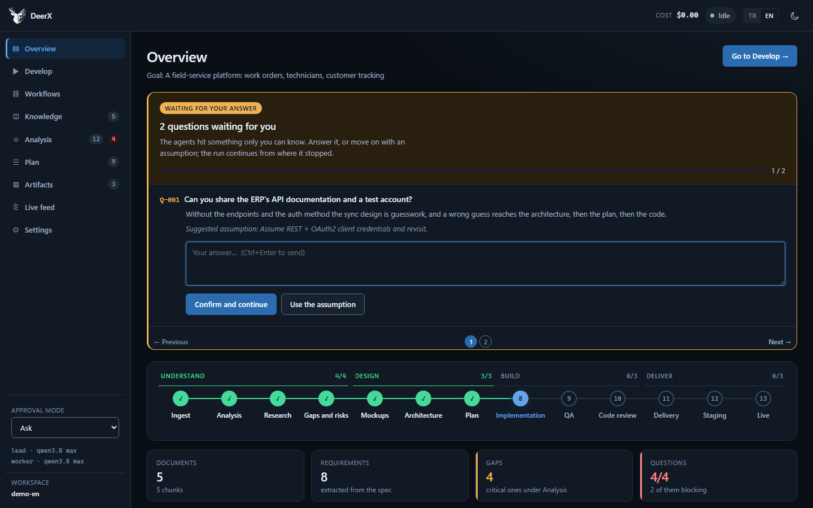
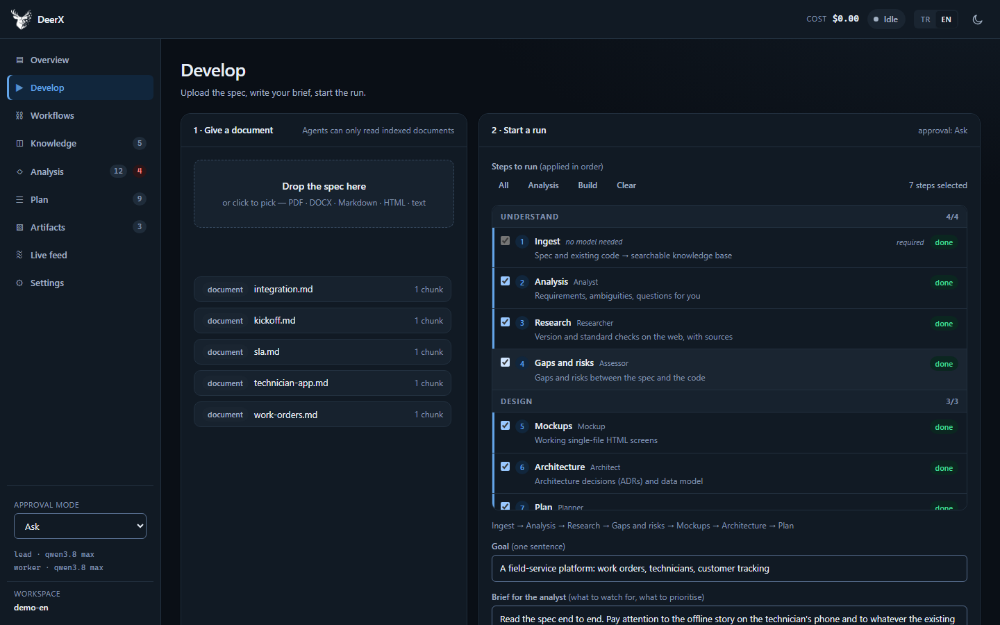
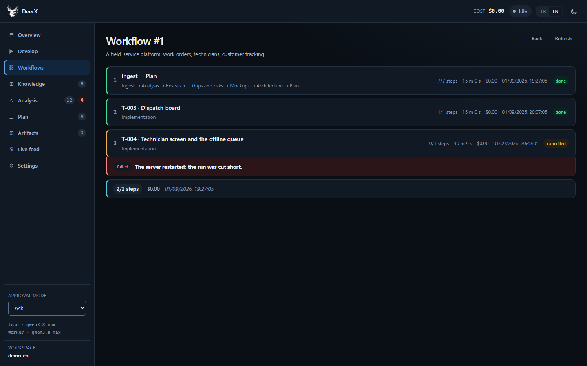
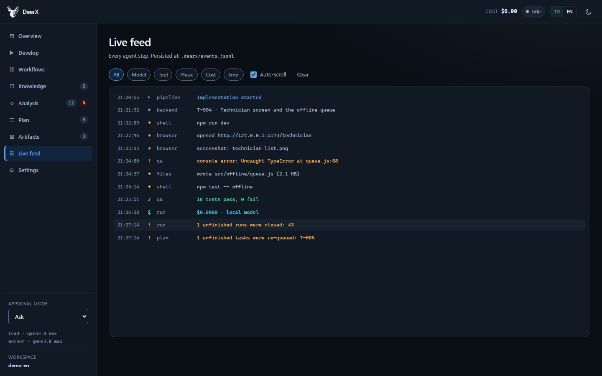
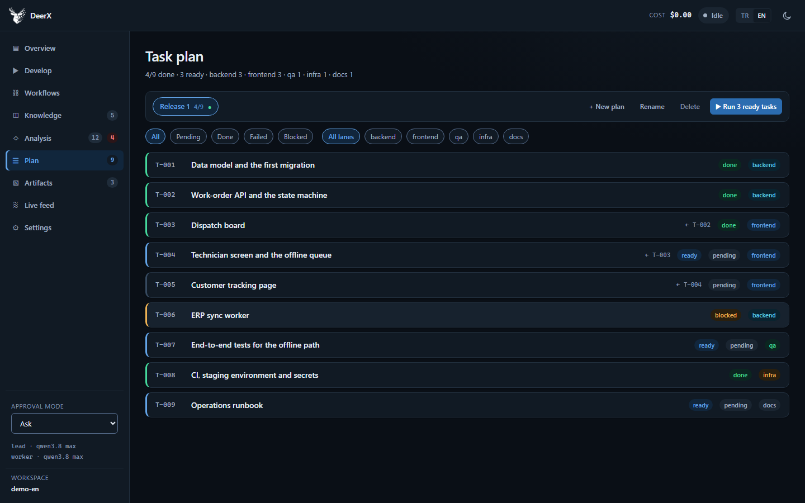
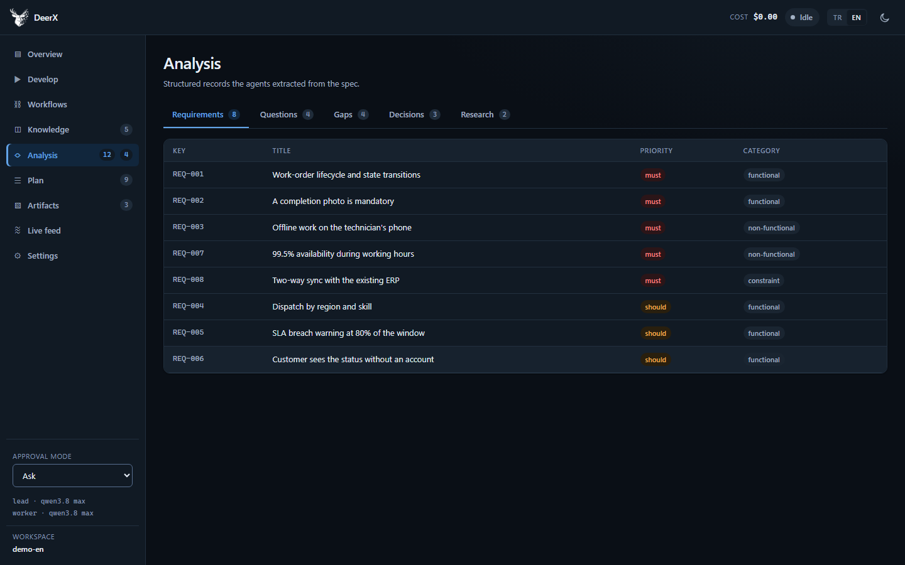
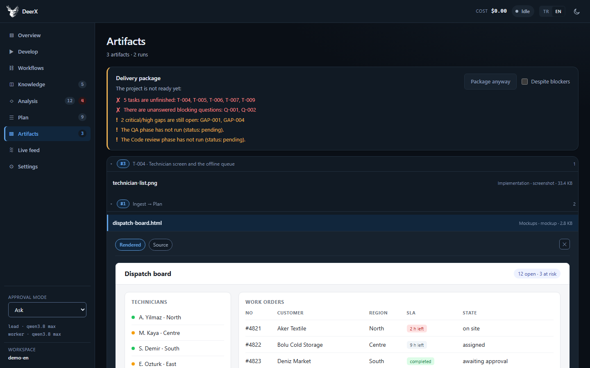
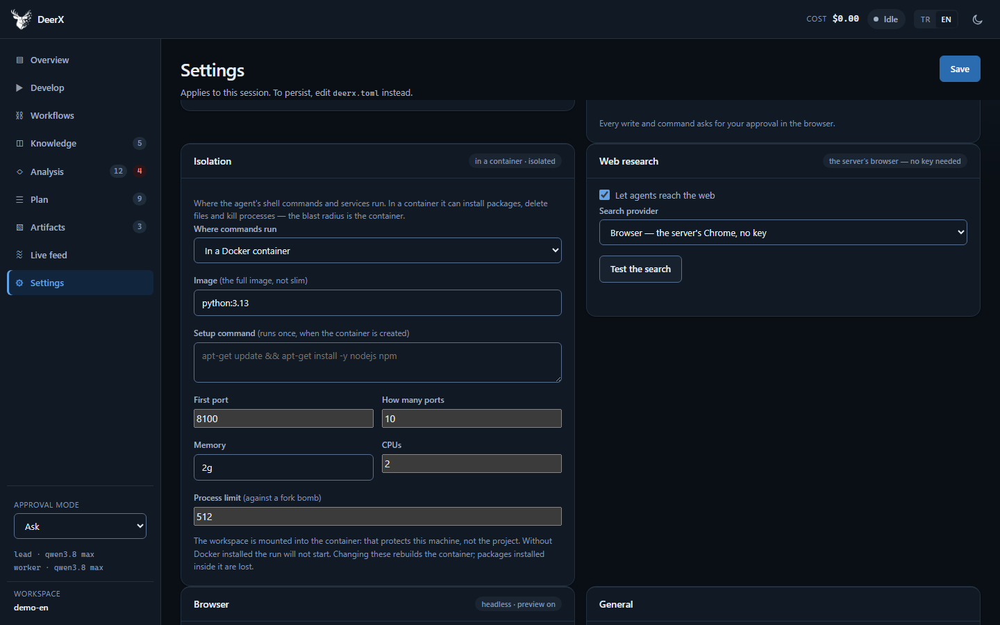

# Web interface

[← Documentation](README.md) · [Türkçe](tr/web-ui.md)

```bash
uv run deerx serve
```

Opens `http://localhost:8791`. No build step — the interface is plain
`index.html` + `styles.css` + `app.js`, served with `no-cache` so a stale
`app.js` cannot outlive an API change.

> The server can write files and run shell commands. It binds `127.0.0.1` by
> default. See [Security model](security.md) before changing that.

## The top bar

Cost, run status, a **TR / EN** language switch and the theme toggle.

The language switch changes everything in one click — and it **persists to the
server**, because only half of what you read comes from the browser. The event
stream, tool errors and the agent instructions come from the Python side; a
switch that changed only the client would leave the interface in English and the
stream in Turkish. If the server refuses the change, the interface reverts with
it rather than sitting in a language the server does not share.

The same setting is still on the Settings screen, and both routes go through one
function — otherwise one of them would persist and the other would not, and the
difference would be invisible.

On narrow screens the cost is dropped from the bar; it is already a card on the
Overview.

## The left rail

The sections, and at the bottom the three things that are true no matter which
screen you are on: the approval mode, the two models in use, and **which
workspace you are in** — its folder name.

That last one is there because two DeerX windows on the same machine look
identical. The path was a row on the Settings screen, which meant checking it
required leaving the screen you were about to press **Start** on.

Only the folder name is printed. The name is what tells two workspaces apart;
the full path took two lines and put a home directory into every screenshot of
the interface. It is on the button's tooltip, and clicking copies it — if the
clipboard is unavailable the path comes back as a toast, so the button is never
silently dead.

On narrow screens the whole rail foot is dropped along with the rail's vertical
layout; the workspace is still on the Settings screen.

## Overview



The summary dashboard. **Questions waiting for an answer** sit at the top —
above everything else, because a blocked pipeline is the only thing that needs
you right now.

Below: the 13-phase pipeline strip (which agent, which status, what it cost),
count cards, a phase summary with each agent's own closing note (newest first),
and recent events.

## Develop



Where the work starts. Two steps side by side.

**1 · Give a document.** Drag the specification in. The file lands under
`docs/`, is indexed immediately, and the documents the model can actually read
are listed right underneath — so "did it get my spec?" is answered on the same
screen.

**2 · Start a run.** You pick the steps from a list, grouped into four stages
(**Understand · Design · Build · Deliver**). Clicking a stage heading selects or
clears the whole group.

Each row says what the step will *produce* rather than what it is called —
"A task list split into lanes, with dependencies" rather than "plan". A list of
phase names is not information if you do not already know the pipeline.

Rows also show which agent will run, a badge if the step is already done, and
its cost. The presets `All` / `Analysis` / `Code` come ready, and the path the
run will follow is summarised on one line below the list.

Two behaviours worth knowing:

- The selection is arranged in **pipeline order** regardless of the order you
  clicked.
- **Step 1 (ingest) is always included.** With an empty knowledge base no later
  agent has anything to read.

## Runs



Every run is persistent under its own id and gets a sequential number
(`#1`, `#2`, …).

The list shows goal, steps, how many finished, duration, cost, date and status.
Opening a run gives a step-by-step breakdown — each step on its own card: which
agent ran, how many tool calls and model responses, how many errors and
warnings, how long, what it cost, what it produced. Expanding a card reveals the
agent's closing summary, the error text, the artifacts (clickable) and **that
step's raw event stream**.

Running steps and steps with problems come open by themselves.

**Steps come from the run's own record**, not from the phase state. Phase state
belongs to the project and is overwritten on every re-run — reading it while
looking at a past run would show you today's result under yesterday's heading.
Events are tagged with the run and phase that produced them, and the breakdown
survives a server restart through `.deerx/events.jsonl`.

### Resuming after a failure

A failed step carries a **Re-run from here** button, and the workflow view shows
**Resume from the failed step** next to the error. Either one starts a fresh run
that begins at that step and continues through the rest of *that run's* steps.

Three things make this faithful rather than approximate:

* **The earliest failure is chosen**, not the last. Later failures are usually
  consequences of the first one; starting behind them walks into the same wall.
* **The step list comes from the original run**, not from the pipeline order. If
  you ran `ingest → analyze → plan`, the retry will not quietly add `research`
  and `assess` — you left those out on purpose.
* **The run remembers what it was running.** A run started for a single task
  carries that task key, so the retry runs that task and not every task that
  happens to be ready.

Steps are forced rather than skipped: you asked for this one explicitly, and
"already done" would make the button do nothing. The steps after it are forced
too, because output built on a step that failed is suspect.

A step waiting on an answer (`needs_input`) is not offered a retry. The agent
did its work and is waiting on you; re-running it only asks the same question
twice. Answer it in **Overview** instead.

The retry is recorded in the audit log as `run.retry`.

## Live stream



Every step an agent takes arrives over SSE: tool calls, model text, cost,
errors. Filterable by type and paginated — the last page is "live" and new
events flow there.

Going back to an earlier page does not make the stream slide out from under you.
The counter keeps rising and a **● Back to live** button appears.

**It opens with history, not empty.** The tail of `.deerx/events.jsonl` is read
back on load, so a restarted server does not erase what the agent did — the
overview's *Recent events* fills in too. The stream had claimed to be persisted
while showing nothing after a refresh; auditability that stops at the screen is
not auditability.

## Plan



**Multiple plans.** A plan is a named, independent group of tasks: parallel
workstreams, alternative approaches, or a new version after the spec changed.
The strip at the top selects, creates, renames and deletes them. **●** marks the
*active* plan — where the planner writes new tasks.

The task list filters by the selected plan. Each task can be advanced
individually (**Implement this task**), or the whole plan run with **▶ Start** —
the button says how many tasks are ready, and why none are if that is the case.

Task keys are unique project-wide, so a task in one plan can depend on a task in
another with no ambiguity.

## Analysis



Requirements, gaps, architectural decisions and research findings. Clicking a
row opens its evidence and recommendation. Paginated (25/50/100/250); switching
tabs returns to page one, and open detail rows do not bleed across pages.

**Open questions are answerable here.** The Questions tab is not a read-only
log: expanding an open question gives you the answer box, and the answer goes
into the knowledge base like any other. Only *blocking* questions used to be
answerable, and only during the halt — a question the pipeline had walked past
could never be answered, which sits badly with a product whose first claim is
that it asks instead of guessing.

## Artifacts



**Grouped by run, collapsible.** Each row is a run: **the workflow it belongs
to**, its own number, its goal, how many attachments (🗜) and how many
artifacts. Opening it lists everything that run produced, each saying which
phase made it. The newest run comes open and the rest closed — with twenty runs,
all-open means you cannot find the one you came for.

A run is a *step of a workflow*, so "which workflow did this mockup come from?"
used to have no answer on this screen — you had to go to Workflows and hunt. The
`WF #n` badge answers it, and clicking it takes you to that workflow's steps.
Runs recorded before workflows existed carry no badge rather than an invented
number.

- Markdown reports are rendered; raw HTML injection is disabled.
- HTML mockups render live inside a `sandbox` iframe.
- **Screenshots are shown, not offered for download.** `browser_screenshot`
  says the user sees the image in the interface; while `.png` counted as opaque
  binary that was not true. Raster images (`png`, `jpg`, `gif`, `webp`, `avif`)
  render inline. `.svg` deliberately does not: SVG can carry script, and opened
  directly it would run in the application's own origin.
- Zip and other binary artifacts sit as **attachments** with a download card.
  Dumping an archive's bytes as text produces a screen of garbage; instead the
  package's `TESLIMAT.md` is rendered underneath as a report.

Delivery packages appear under their own runs, not duplicated at the top.
Manual packaging creates a single-step run record — otherwise the package it
produced would belong to no run at all.

Artifacts from before run records existed are hidden by default, but they are
**counted and reachable**: a button in the header says how many there are and
reveals them under *Produced before run tracking*. The badge used to say 11 while
the screen showed 1, with no control anywhere to close the gap.

The same view carries the **delivery panel**: readiness status, a package
button, zip downloads and a **Report** button per package.

## Settings



Ten panels: model provider, models, generation limits, run behaviour,
**isolation**, web research, browser, general (language, log level), users and
your account.

**Isolation** is where `execution` lives — host or Docker container — with the
image, the setup command, the published port range and the memory/CPU/process
limits. It was configurable only by hand-editing `deerx.toml`, even though
running isolated is one of the three things the README leads with. Choosing
*host* hides the container fields rather than showing settings nothing reads.

Three buttons make real calls:

- **Test the connection** tells the model to write "OK" and reports the
  duration, token count and answer.
- **Test search** actually searches.
- **Test the browser** actually opens one.

The difference between these buttons and discovering "the model name was wrong"
forty minutes into a run is the reason they exist.

Each panel header carries a status line derived from the settings — whether a
key is set, which search provider is in use, whether the browser runs headless
and may open the agent's own app. The search line names the provider's licence
situation rather than assuming a key is required: three of the six providers
(`browser`, `duckduckgo`, `searxng`) need none, and a fresh install used to open
with a red "search will not work" warning next to a search that worked.

Three rules:

- **API keys never come back** — only whether they are set.
- **A model setting cannot change mid-run**, and changing one drops the LLM
  client. The client reads those values at construction, so without the drop the
  change would quietly do nothing until a restart.
- **Isolation cannot change mid-run either**, and changing it rebuilds the
  container. Docker fixes published ports and resource limits at creation time,
  so nothing less than a rebuild would take effect.
- **Changes are session-scoped.** Write them to `deerx.toml` to persist.

## The approval gate

With `approval_mode = "ask"`, every file write and command execution is shown in
the browser with its preview, and the run thread blocks until you answer.

That blocking is real, not cosmetic: a test verifies the run thread is actually
held and released by the answer.

## Users and authentication

Authentication is active **as soon as one user exists**. A local install with no
users works as it always did — but **a server with no users cannot be exposed**:
`--host 0.0.0.0` refuses to start. Printing a warning would not be enough for an
endpoint that writes files and runs commands.

The first administrator is created with a **setup token** printed only to the
server's console, so whoever reaches the server first cannot claim the admin
account.

Administrators manage accounts from the interface, including **disable**.
Disabling is not deleting — someone who left may return, and deleting their
account would make their traces in the history meaningless. A disabled account's
sessions drop immediately; otherwise disabling would do nothing until they
signed out.

See [Security model](security.md) for the password policy and the decisions
behind it.

## The audit log

Below the account panels, and **only for administrators**: who signed in when,
what they ran, what they changed. Every row carries a time, a name, an action, a
detail and the address it came from; refused sign-in attempts are in there too,
in red and under the name that was tried.

Three filters — person, kind of action, number of rows. The lists that fill them
come from the log itself, not from the user list: a deleted account's rows are
still searchable, and a name that was only ever *attempted* is offered as well.
They also do not narrow each other. Picking "Runs" leaves the person list whole,
because a filter that shrinks the other filter makes the second choice
impossible.

Action names are stored as fixed identifiers and translated at render time. The
run titles carry a translation key too, which is why a run started in Turkish
still reads correctly on an English screen — the same lesson the run list
learned the hard way.

The log is capped at the last 5000 rows and shares the project database.

## Design

The palette derives from the brand: the logo's navy (`#082850`) is the starting
point and the whole scale stays in that blue family. Semantic colours
(ok/warn/err/info) were pulled into the same lightness and saturation family so
none reads louder than the others side by side. Typography rests on seven sizes,
four weights and a 4px spacing grid.

None of this is by eye. **All 1458 rendered text elements pass WCAG AA**, and
the scale is locked in `tests/test_web.py`: `TestPalette` checks contrast and
brand hue, `TestDesignScale` checks the size/weight/spacing scale and the
heading hierarchy.

Light and dark themes, full keyboard navigation, mobile layout.

## Interface integrity

A set of tests checks that every `#id` the JS looks for exists in the HTML, that
every `data-view` target has a section, and that every CSS class used in the
HTML or JS is defined. Those are exactly the things that break silently when a
view is moved.
